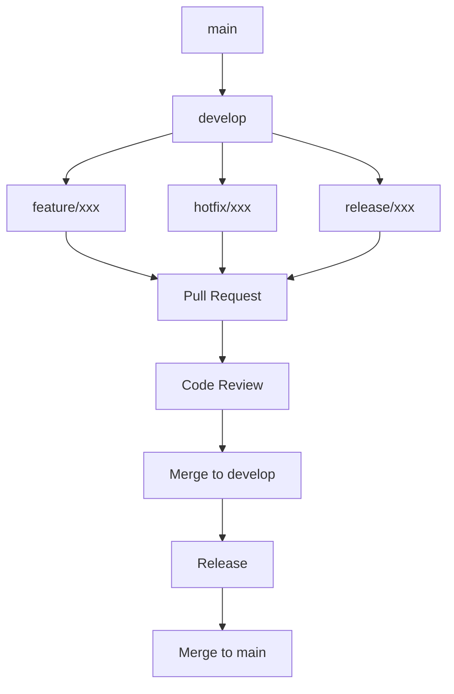

# 贡献指南

## 🤝 欢迎贡献

感谢您对 Transformer 深度学习平台的关注！我们欢迎所有形式的贡献，包括但不限于：

- 🐛 **Bug 报告**：发现并报告问题
- 💡 **功能建议**：提出新功能想法
- 📝 **文档改进**：完善项目文档
- 🔧 **代码贡献**：提交代码修复或新功能
- 🧪 **测试用例**：增加测试覆盖率
- 🎨 **UI/UX 改进**：优化用户界面
- 📊 **性能优化**：提升系统性能

## 🚀 快速开始

### 1. 环境准备

#### 系统要求

- **操作系统**: Linux/macOS/Windows (推荐使用 WSL2)
- **Python**: 3.9 或更高版本
- **Node.js**: 18.0 或更高版本
- **Docker**: 20.10 或更高版本
- **Git**: 2.30 或更高版本

#### 开发工具

推荐的开发工具：

| 工具 | 用途 | 推荐配置 |
|------|------|----------|
| VS Code | 代码编辑器 | 安装 Python、TypeScript、Docker 扩展 |
| PyCharm | Python 开发 | 配置 poetry 环境 |
| Chrome | 前端调试 | 安装 React Developer Tools |
| Postman | API 测试 | 导入 API 集合 |

### 2. 项目设置

#### Fork 和克隆

```bash
# 1. Fork 项目到您的 GitHub 账户
# 2. 克隆您的 Fork
git clone https://github.com/YOUR_USERNAME/transformer-platform.git
cd transformer-platform

# 3. 添加上游仓库
git remote add upstream https://github.com/ORIGINAL_OWNER/transformer-platform.git

# 4. 验证远程仓库
git remote -v
```

#### 环境配置

```bash
# 后端环境
cd backend
python -m venv venv
source venv/bin/activate  # Windows: venv\Scripts\activate
poetry install

# 前端环境
cd ../frontend
npm install

# 开发环境启动
cd ../deploy
docker-compose -f docker-compose.dev.yml up -d
```

#### 开发工具配置

**VS Code 配置 (.vscode/settings.json):**

```json
{
  "python.defaultInterpreterPath": "./backend/venv/bin/python",
  "python.linting.enabled": true,
  "python.linting.pylintEnabled": false,
  "python.linting.flake8Enabled": true,
  "python.formatting.provider": "black",
  "editor.formatOnSave": true,
  "editor.codeActionsOnSave": {
    "source.organizeImports": true
  },
  "typescript.preferences.importModuleSpecifier": "relative",
  "eslint.workingDirectories": ["frontend"],
  "prettier.configPath": "frontend/.prettierrc"
}
```

## 📋 开发流程

### 1. 分支策略

我们采用 Git Flow 工作流：



#### 分支命名规范

| 分支类型 | 命名格式 | 示例 |
|----------|----------|------|
| 功能分支 | `feature/功能描述` | `feature/sparse-attention-optimization` |
| 修复分支 | `fix/问题描述` | `fix/memory-leak-in-moe` |
| 热修复分支 | `hotfix/紧急修复` | `hotfix/critical-security-fix` |
| 发布分支 | `release/版本号` | `release/v1.2.0` |
| 文档分支 | `docs/文档类型` | `docs/api-documentation` |

### 2. 开发步骤

#### 创建功能分支

```bash
# 1. 更新 develop 分支
git checkout develop
git pull upstream develop

# 2. 创建功能分支
git checkout -b feature/your-feature-name

# 3. 开始开发
```

#### 开发规范

**代码提交规范：**

使用约定式提交格式：

```
<type>[optional scope]: <description>

[optional body]

[optional footer(s)]
```

**提交类型：**

| 类型 | 描述 | 示例 |
|------|------|------|
| feat | 新功能 | `feat(moe): add expert pruning mechanism` |
| fix | 修复 Bug | `fix(attention): resolve memory leak in sparse attention` |
| docs | 文档更新 | `docs(api): update forward endpoint documentation` |
| style | 代码格式 | `style(frontend): fix linting errors in components` |
| refactor | 重构 | `refactor(models): simplify transformer block structure` |
| test | 测试相关 | `test(sparse): add unit tests for window calculation` |
| chore | 构建相关 | `chore(deps): update pytorch to version 2.1.0` |

**提交示例：**

```bash
# 好的提交
git commit -m "feat(moe): add load balancing mechanism

Implement dynamic load balancing for MoE experts to ensure
fair utilization across all experts. This improves training
stability and reduces expert bias.

Closes #123"

# 不好的提交
git commit -m "fix bug"
```

#### 代码质量检查

```bash
# 后端代码检查
cd backend

# 格式化代码
black app/ tests/
isort app/ tests/

# 代码检查
flake8 app/ tests/
mypy app/

# 运行测试
pytest tests/ --cov=app

# 前端代码检查
cd ../frontend

# 格式化代码
npm run format

# 代码检查
npm run lint

# 运行测试
npm run test
```

### 3. 提交 Pull Request

#### PR 准备清单

- [ ] 代码通过所有测试
- [ ] 代码符合项目规范
- [ ] 添加了必要的测试用例
- [ ] 更新了相关文档
- [ ] 提交信息符合规范
- [ ] 分支与主分支保持同步

#### PR 模板

```markdown
## 📝 变更描述
简要描述本次变更的内容和目的。

## 🎯 变更类型
- [ ] Bug 修复
- [ ] 新功能
- [ ] 重构
- [ ] 文档更新
- [ ] 性能优化
- [ ] 其他

## 🧪 测试
描述如何测试这些变更：

```bash
# 测试命令
cd backend && pytest tests/test_moe.py -v
cd frontend && npm run test
```

## 📸 截图（如适用）
如果是 UI 相关变更，请提供截图。

## 🔗 相关 Issue
Closes #123

## ✅ 检查清单
- [ ] 我的代码遵循项目的代码规范
- [ ] 我已经进行了自我审查
- [ ] 我已经添加了必要的注释
- [ ] 我的变更生成了新的警告
- [ ] 我已经添加了测试来证明我的修复是有效的或我的功能可以工作
- [ ] 新的和现有的单元测试都通过了
- [ ] 我已经添加了必要的文档
```

## 📝 代码规范

### 1. Python 代码规范

#### 代码风格

遵循 PEP 8 标准，使用以下工具：

```bash
# Black: 代码格式化
black --line-length 88 app/ tests/

# isort: 导入排序
isort --profile black app/ tests/

# flake8: 代码检查
flake8 --max-line-length 88 app/ tests/

# mypy: 类型检查
mypy app/
```

#### 命名规范

| 类型 | 命名方式 | 示例 |
|------|----------|------|
| 变量/函数 | snake_case | `calculate_attention_weights` |
| 类名 | PascalCase | `SparseAttentionLayer` |
| 常量 | UPPER_SNAKE_CASE | `MAX_SEQUENCE_LENGTH` |
| 私有成员 | 前缀下划线 | `_internal_method` |
| 模块名 | 小写+下划线 | `sparse_attention.py` |

#### 文档字符串

```python
def calculate_sparse_attention(
    self, 
    query: torch.Tensor, 
    key: torch.Tensor, 
    value: torch.Tensor,
    mask: Optional[torch.Tensor] = None
) -> torch.Tensor:
    """
    计算稀疏注意力
    
    Args:
        query: 查询张量，形状为 (batch_size, seq_len, n_embed)
        key: 键张量，形状为 (batch_size, seq_len, n_embed)
        value: 值张量，形状为 (batch_size, seq_len, n_embed)
        mask: 可选的注意力掩码
    
    Returns:
        注意力输出张量，形状为 (batch_size, seq_len, n_embed)
    
    Raises:
        ValueError: 当输入张量形状不匹配时
    
    Example:
        >>> attn = SparseAttention(config)
        >>> output = attn.calculate_sparse_attention(q, k, v)
    """
    pass
```

#### 类型注解

```python
from typing import Optional, Dict, List, Tuple, Union
import torch
from torch import Tensor

class MoELayer(nn.Module):
    def __init__(self, config: GPT2Config) -> None:
        super().__init__()
        self.num_experts: int = config.moe_num_experts
        self.top_k: int = config.moe_top_k
    
    def forward(
        self, 
        x: Tensor, 
        return_intermediate: bool = False
    ) -> Union[Tensor, Tuple[Tensor, Dict[str, Tensor]]]:
        """前向传播"""
        pass
```

### 2. TypeScript/React 代码规范

#### ESLint 配置

```json
{
  "extends": [
    "@typescript-eslint/recommended",
    "plugin:react/recommended",
    "plugin:react-hooks/recommended",
    "prettier"
  ],
  "rules": {
    "@typescript-eslint/no-unused-vars": "error",
    "@typescript-eslint/explicit-function-return-type": "warn",
    "react/prop-types": "off",
    "react/react-in-jsx-scope": "off"
  }
}
```

#### 命名规范

| 类型 | 命名方式 | 示例 |
|------|----------|------|
| 组件 | PascalCase | `AttentionVisualization` |
| 变量/函数 | camelCase | `calculateAttentionWeights` |
| 常量 | UPPER_SNAKE_CASE | `MAX_SEQUENCE_LENGTH` |
| 接口 | PascalCase + I 前缀 | `IModelConfig` |
| 类型 | PascalCase | `ModelConfig` |
| 文件名 | PascalCase | `AttentionVisualization.tsx` |

#### 组件示例

```typescript
interface AttentionVisualizationProps {
  attentionWeights: number[][][];
  onTokenSelect?: (tokenIndex: number) => void;
  className?: string;
}

const AttentionVisualization: React.FC<AttentionVisualizationProps> = ({
  attentionWeights,
  onTokenSelect,
  className = '',
}) => {
  const [selectedToken, setSelectedToken] = useState<number | null>(null);
  
  const handleTokenClick = useCallback((tokenIndex: number) => {
    setSelectedToken(tokenIndex);
    onTokenSelect?.(tokenIndex);
  }, [onTokenSelect]);
  
  return (
    <div className={`attention-visualization ${className}`}>
      {/* 组件内容 */}
    </div>
  );
};

export default AttentionVisualization;
```

### 3. 文档规范

#### Markdown 规范

- 使用中文标点符号
- 标题层级清晰
- 代码块指定语言
- 表格格式规范
- 添加适当的 emoji

```markdown
# 一级标题

## 二级标题

### 三级标题

- 列表项 1
- 列表项 2

| 字段 | 类型 | 描述 |
|------|------|------|
| name | string | 名称 |

```python
# 代码示例
def example():
    pass
```
```

## 🧪 测试指南

### 1. 后端测试

#### 测试结构

```
backend/tests/
├── unit/                 # 单元测试
│   ├── test_attention.py
│   ├── test_moe.py
│   └── test_sparse_attention.py
├── integration/          # 集成测试
│   ├── test_api.py
│   └── test_model_integration.py
├── e2e/                  # 端到端测试
│   └── test_full_pipeline.py
└── conftest.py           # pytest 配置
```

#### 单元测试示例

```python
import pytest
import torch
from app.models.transformer.moe import MoELayer
from app.models.transformer.config import GPT2Config

class TestMoELayer:
    @pytest.fixture
    def config(self):
        return GPT2Config(
            n_embed=256,
            use_moe=True,
            moe_num_experts=4,
            moe_top_k=2
        )
    
    @pytest.fixture
    def moe_layer(self, config):
        return MoELayer(config)
    
    def test_forward_shape(self, moe_layer):
        """测试前向传播输出形状"""
        x = torch.randn(2, 10, 256)
        output = moe_layer(x)
        assert output.shape == x.shape
    
    def test_top_k_routing(self, moe_layer):
        """测试 Top-k 路由机制"""
        x = torch.randn(1, 5, 256)
        output, intermediate = moe_layer(x, return_intermediate=True)
        
        top_k_indices = intermediate['top_k_indices']
        assert top_k_indices.shape == (1, 5, 2)  # batch, seq, top_k
        assert top_k_indices.max() < moe_layer.num_experts
    
    @pytest.mark.parametrize("batch_size", [1, 2, 4])
    @pytest.mark.parametrize("seq_len", [5, 10, 20])
    def test_different_shapes(self, moe_layer, batch_size, seq_len):
        """测试不同输入形状"""
        x = torch.randn(batch_size, seq_len, 256)
        output = moe_layer(x)
        assert output.shape == x.shape
```

#### 集成测试示例

```python
import pytest
from fastapi.testclient import TestClient
from app.main import app

client = TestClient(app)

class TestModelAPI:
    def test_initialize_model(self):
        """测试模型初始化"""
        response = client.get("/api/v1/initialize")
        assert response.status_code == 200
        
        data = response.json()
        assert data["success"] is True
        assert "config" in data
    
    def test_forward_with_valid_text(self):
        """测试有效文本的前向传播"""
        # 先初始化模型
        client.get("/api/v1/initialize")
        
        # 发送推理请求
        response = client.post(
            "/api/v1/forward",
            json={"text": "测试文本", "capture_data": True}
        )
        
        assert response.status_code == 200
        data = response.json()
        assert data["success"] is True
        assert "logits_shape" in data
        assert "captured_data" in data
    
    def test_forward_with_empty_text(self):
        """测试空文本的错误处理"""
        response = client.post(
            "/api/v1/forward",
            json={"text": "", "capture_data": False}
        )
        
        assert response.status_code == 400
        assert "输入文本不能为空" in response.json()["detail"]
```

#### 测试运行

```bash
# 运行所有测试
pytest

# 运行特定测试文件
pytest tests/unit/test_moe.py

# 运行特定测试类
pytest tests/unit/test_moe.py::TestMoELayer

# 运行特定测试方法
pytest tests/unit/test_moe.py::TestMoELayer::test_forward_shape

# 生成覆盖率报告
pytest --cov=app --cov-report=html

# 并行运行测试
pytest -n auto
```

### 2. 前端测试

#### 测试结构

```
frontend/src/
├── __tests__/           # 测试文件
│   ├── components/
│   ├── hooks/
│   ├── services/
│   └── utils/
├── setupTests.ts        # 测试配置
└── vitest.config.ts     # Vitest 配置
```

#### 组件测试示例

```typescript
import { render, screen, fireEvent } from '@testing-library/react';
import { describe, it, expect, vi } from 'vitest';
import AttentionVisualization from '../AttentionVisualization';

describe('AttentionVisualization', () => {
  const mockProps = {
    attentionWeights: [
      [
        [0.1, 0.2, 0.7],
        [0.3, 0.4, 0.3],
        [0.5, 0.3, 0.2],
      ],
    ],
    onTokenSelect: vi.fn(),
  };

  it('renders attention weights correctly', () => {
    render(<AttentionVisualization {...mockProps} />);
    
    // 检查是否渲染了注意力权重
    expect(screen.getByTestId('attention-weights')).toBeInTheDocument();
  });

  it('calls onTokenSelect when token is clicked', () => {
    render(<AttentionVisualization {...mockProps} />);
    
    const token = screen.getByTestId('token-0');
    fireEvent.click(token);
    
    expect(mockProps.onTokenSelect).toHaveBeenCalledWith(0);
  });

  it('applies custom className', () => {
    const { container } = render(
      <AttentionVisualization {...mockProps} className="custom-class" />
    );
    
    expect(container.firstChild).toHaveClass('custom-class');
  });
});
```

#### Hook 测试示例

```typescript
import { renderHook, act } from '@testing-library/react';
import { describe, it, expect } from 'vitest';
import { useModelConfig } from '../useModelConfig';

describe('useModelConfig', () => {
  it('initializes with default config', () => {
    const { result } = renderHook(() => useModelConfig());
    
    expect(result.current.config.n_layer).toBe(12);
    expect(result.current.config.use_moe).toBe(false);
  });

  it('updates config correctly', () => {
    const { result } = renderHook(() => useModelConfig());
    
    act(() => {
      result.current.updateConfig({ use_moe: true, n_layer: 6 });
    });
    
    expect(result.current.config.use_moe).toBe(true);
    expect(result.current.config.n_layer).toBe(6);
  });
});
```

## 🐛 Bug 报告

### Bug 报告模板

```markdown
## 🐛 Bug 描述
简洁清晰地描述 bug。

## 🔄 复现步骤
详细描述如何复现这个 bug：

1. 执行命令 '...'
2. 点击 '....'
3. 滚动到 '....'
4. 看到错误

## 🎯 期望行为
描述你期望发生的行为。

## 📸 实际行为
描述实际发生的行为，附上截图或错误日志。

## 📋 环境信息
- 操作系统: [例如 Ubuntu 20.04]
- Python 版本: [例如 3.9.7]
- Node.js 版本: [例如 18.17.0]
- 浏览器: [例如 Chrome 118.0]

## 📝 附加信息
添加任何其他有助于解决问题的信息。
```

## 💡 功能请求

### 功能请求模板

```markdown
## 🚀 功能描述
简洁清晰地描述您想要的功能。

## 🎯 问题背景
描述这个功能要解决的问题。

## 💡 解决方案
描述您希望的解决方案。

## 🔄 替代方案
描述您考虑过的其他解决方案。

## 📋 附加信息
添加任何其他相关信息或截图。
```

## 📚 文档贡献

### 文档类型

| 文档类型 | 位置 | 负责人 |
|----------|------|--------|
| API 文档 | `docs/api-reference.md` | 开发团队 |
| 用户指南 | `docs/` | 技术写作 |
| 开发文档 | `docs/` | 开发团队 |
| 代码注释 | 源码文件 | 代码贡献者 |

### 文档规范

1. **语言**: 使用简体中文
2. **格式**: Markdown 格式
3. **示例**: 提供可运行的代码示例
4. **更新**: 与代码同步更新

## 🏆 贡献者认可

### 贡献类型

- 💻 **代码**: 编写或修改代码
- 📖 **文档**: 改进文档
- 🐛 **Bug**: 发现和修复 Bug
- 💡 **想法**: 提出功能建议
- 🎨 **设计**: UI/UX 设计
- 🧪 **测试**: 编写测试用例
- 📊 **数据**: 提供数据或分析

### 认可方式

- 在 README 中添加贡献者列表
- 在发布说明中感谢贡献者
- 颁发贡献者徽章
- 邀请加入核心团队

## 📞 联系方式

### 获取帮助

- **GitHub Issues**: 报告 Bug 或功能请求
- **GitHub Discussions**: 技术讨论
- **邮件**: dev@example.com
- **即时通讯**: [Discord/Slack 频道]

### 代码审查

所有代码都需要经过代码审查：

1. **自动检查**: CI/CD 流水线
2. **人工审查**: 至少一位维护者审查
3. **测试验证**: 所有测试通过
4. **文档更新**: 相关文档同步更新

## 📋 行为准则

### 我们的承诺

为了营造开放和友好的环境，我们承诺：

- 尊重所有参与者
- 专注于对社区最有利的事情
- 对其他社区成员表示同理心

### 期望行为

- 使用友好和包容的语言
- 尊重不同的观点和经验
- 优雅地接受建设性批评
- 专注于对社区最有利的事情
- 对其他社区成员表示同理心

### 不当行为

- 使用性别化语言或图像
- 人身攻击或政治攻击
- 公开或私下骚扰
- 未经明确许可发布他人的私人信息

## 🎉 致谢

感谢所有为项目做出贡献的开发者！

### 核心贡献者

- [@contributor1](https://github.com/contributor1) - 项目创始人
- [@contributor2](https://github.com/contributor2) - 核心开发者
- [@contributor3](https://github.com/contributor3) - 文档维护者

### 特别感谢

- 所有提交 Issue 的用户
- 所有贡献代码的开发者
- 所有改进文档的贡献者

---

💡 **提示**: 如果您对贡献流程有任何疑问，请不要犹豫在 GitHub Discussions 中提问！