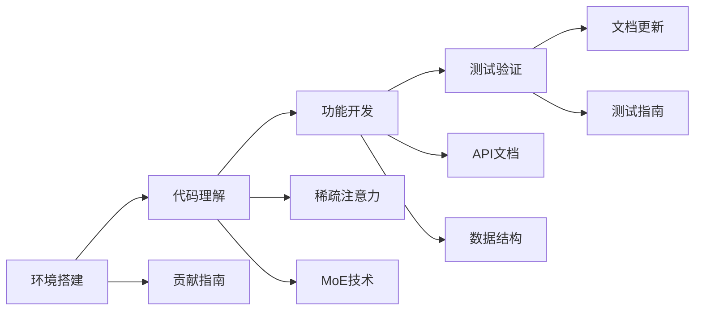
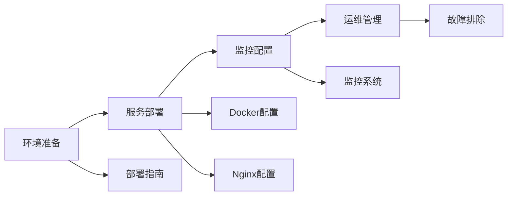
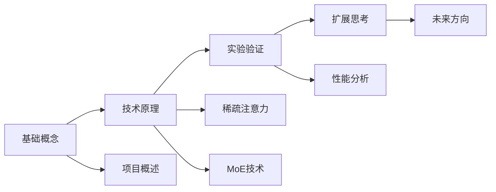

# 📚 Transformer 深度学习平台文档

欢迎查看 Transformer 深度学习平台的完整文档体系。本文档提供了从基础概念到高级部署的全方位指导。

## 📋 文档目录

### 🚀 快速开始
- [主 README](../README.md) - 项目概述和快速开始指南
- [部署指南](deployment-guide.md) - 详细的部署配置说明

### 🔬 技术文档
- [稀疏注意力设计](sparse-attention.md) - 稀疏注意力机制的详细设计说明
- [MoE 技术说明](moe-design.md) - 混合专家模型的技术实现
- [数据结构说明](data-structures.md) - 核心数据结构和 API 格式

### 📡 API 参考
- [API 接口文档](api-reference.md) - 完整的 REST API 接口说明

### 🤝 开发指南
- [贡献指南](../CONTRIBUTING.md) - 如何参与项目贡献

## 📖 文档导航

### 按角色分类

#### 👨‍💻 开发者
如果您是开发者，建议按以下顺序阅读：

1. **项目理解**：[主 README](../README.md) → [稀疏注意力设计](sparse-attention.md) → [MoE 技术说明](moe-design.md)
2. **开发准备**：[贡献指南](../CONTRIBUTING.md) → [数据结构说明](data-structures.md)
3. **API 集成**：[API 接口文档](api-reference.md)
4. **部署上线**：[部署指南](deployment-guide.md)

#### 🚀 运维工程师
如果您负责部署和运维，建议重点关注：

1. **环境准备**：[部署指南](deployment-guide.md) 中的环境配置部分
2. **部署实施**：Docker Compose 配置和 Nginx 配置
3. **监控运维**：性能监控、日志管理、故障排除
4. **安全配置**：网络安全、应用安全、备份策略

#### 🎓 研究人员
如果您是研究人员或学生，建议重点关注：

1. **技术原理**：[稀疏注意力设计](sparse-attention.md) → [MoE 技术说明](moe-design.md)
2. **实验验证**：各文档中的实验验证部分
3. **性能分析**：详细的性能指标和基准测试
4. **扩展方向**：未来研究方向和优化建议

#### 👨‍🎨 产品经理
如果您是产品经理，建议关注：

1. **功能特性**：[主 README](../README.md) 中的功能特性部分
2. **技术优势**：各技术文档中的性能对比和优势分析
3. **应用场景**：实际应用场景和配置建议
4. **发展规划**：路线图和未来版本计划

### 按使用场景分类

#### 🔧 本地开发

#### 🚀 生产部署

#### 📚 学习研究

## 📊 文档统计

| 文档类型 | 文档数量 | 主要内容 | 适用人群 |
|----------|----------|----------|----------|
| 技术设计 | 3 | 核心技术实现原理 | 开发者、研究人员 |
| API 参考 | 1 | 接口规范和示例 | 开发者、集成人员 |
| 部署运维 | 1 | 部署配置和运维 | 运维工程师 |
| 开发指南 | 1 | 贡献流程和规范 | 所有贡献者 |

## 🔍 快速查找

### 常见问题快速定位

| 问题类型 | 相关文档 | 关键章节 |
|----------|----------|----------|
| 如何部署项目？ | [部署指南](deployment-guide.md) | 快速部署、Docker 配置 |
| 稀疏注意力如何工作？ | [稀疏注意力设计](sparse-attention.md) | 架构设计、核心算法 |
| MoE 路由机制？ | [MoE 技术说明](moe-design.md) | Top-k 路由、负载均衡 |
| API 如何调用？ | [API 接口文档](api-reference.md) | 接口示例、错误处理 |
| 如何贡献代码？ | [贡献指南](../CONTRIBUTING.md) | 开发流程、代码规范 |

### 配置参数速查

| 配置项 | 默认值 | 说明文档 | 配置位置 |
|--------|--------|----------|----------|
| `use_sparse_attention` | `false` | [稀疏注意力设计](sparse-attention.md#配置参数) | 模型配置 |
| `use_moe` | `false` | [MoE 技术说明](moe-design.md#配置参数) | 模型配置 |
| `moe_num_experts` | `8` | [MoE 技术说明](moe-design.md#配置参数) | 模型配置 |
| `window_size` | `128` | [稀疏注意力设计](sparse-attention.md#配置参数) | 稀疏注意力配置 |
| `BACKEND_PORT` | `8000` | [部署指南](deployment-guide.md#环境变量) | 环境变量 |
| `FRONTEND_PORT` | `3000` | [部署指南](deployment-guide.md#环境变量) | 环境变量 |

## 📝 文档使用建议

### 📖 阅读技巧

1. **循序渐进**：按照文档导航的顺序阅读，建立完整认知
2. **理论结合实践**：阅读文档时配合实际代码和实验
3. **重点标记**：使用书签或笔记记录重要内容
4. **交叉参考**：在不同文档间跳转，理解关联关系

### 🔍 搜索技巧

1. **关键词搜索**：使用 Ctrl+F 快速定位特定内容
2. **目录导航**：利用各文档的目录结构快速跳转
3. **图表理解**：重点关注架构图和流程图
4. **代码示例**：复制运行示例代码加深理解

### 📝 笔记建议

1. **关键概念**：记录核心概念和定义
2. **配置要点**：整理重要的配置参数
3. **问题解决**：记录遇到的问题和解决方案
4. **扩展思考**：记录自己的理解和扩展想法

## 🔄 文档更新

### 更新频率
- **主 README**：随版本发布更新
- **技术文档**：功能变更时更新
- **API 文档**：接口变更时更新
- **部署指南**：部署方式变更时更新

### 版本对应
| 文档版本 | 项目版本 | 更新内容 |
|----------|----------|----------|
| v1.0.0 | v1.0.0 | 初始版本，包含完整文档体系 |
| v1.1.0 | v1.1.0 | 新增 WebSocket 实时推理文档 |
| v1.2.0 | v1.2.0 | 新增分布式训练文档 |

### 贡献方式
如果您发现文档中的错误或有改进建议，欢迎：

1. **提交 Issue**：在 GitHub 上提交文档相关 Issue
2. **直接修改**：Fork 项目后直接修改文档并提交 PR
3. **反馈意见**：通过邮件或讨论区反馈使用体验

## 📞 获取帮助

如果在阅读文档过程中遇到问题，可以通过以下方式获取帮助：

- **GitHub Issues**：[提交问题](https://github.com/your-org/transformer-platform/issues)
- **GitHub Discussions**：[技术讨论](https://github.com/your-org/transformer-platform/discussions)
- **邮件支持**：docs@example.com

---

💡 **提示**：建议将此文档页面加入书签，方便随时查阅其他文档。