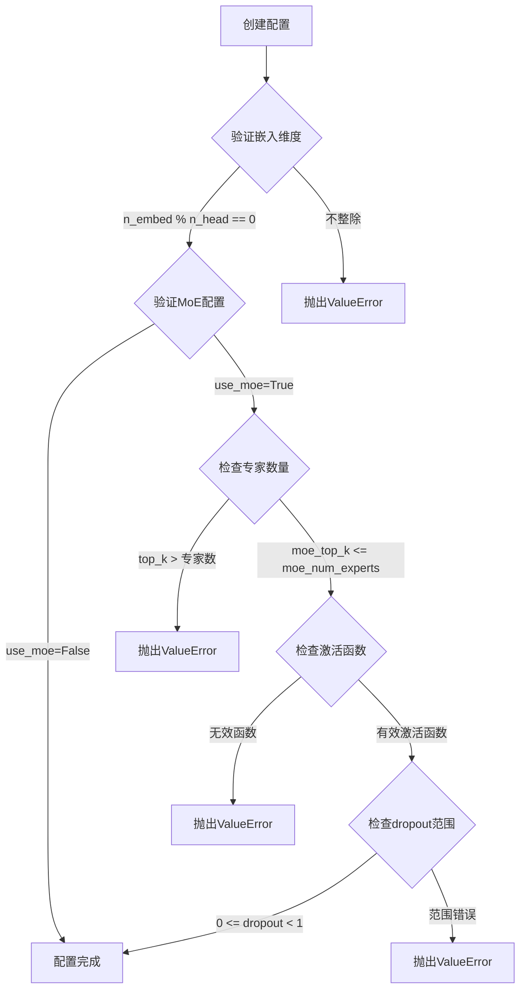
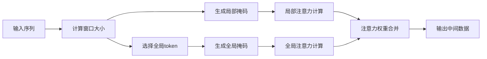
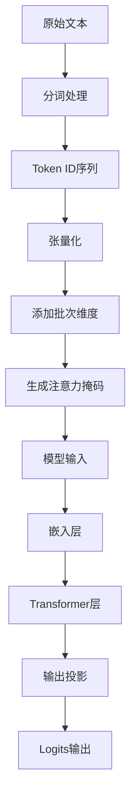

# 数据结构说明文档

## 📖 概述

本文档详细说明了项目中使用的各种数据结构，包括配置类、数据模式、中间张量格式等。理解这些数据结构对于正确使用和扩展项目功能至关重要。

## 🏗️ 核心数据结构

### 1. 模型配置类

#### GPT2Config

```python
@dataclass
class GPT2Config:
    """
    GPT-2风格Transformer模型的配置类
    
    包含模型所需的所有超参数，支持稀疏注意力和MoE等高级功能
    """
    # 基础模型配置
    vocab_size: int = 50304          # 词表大小，通常是2的幂次
    context_size: int = 1024         # 上下文窗口大小
    n_layer: int = 12                # Transformer层数
    n_head: int = 12                 # 注意力头数
    n_embed: int = 768               # 嵌入维度
    
    # 训练相关配置
    dropout: float = 0.1             # Dropout概率
    bias: bool = True                # 是否使用偏置项
    
    # 前馈网络配置
    ffn_hidden_multiplier: int = 4   # 前馈网络隐藏层维度倍数
    
    # 稀疏注意力配置
    use_sparse_attention: bool = False  # 稀疏注意力开关
    
    # MoE配置
    use_moe: bool = False              # MoE开关
    moe_num_experts: int = 8           # 专家数量
    moe_top_k: int = 2                 # MoE路由top-k
    moe_activation: str = "gelu"       # MoE专家激活函数
    moe_dropout: Optional[float] = None # MoE专用dropout
```

**配置验证流程：**



#### SparseAttentionConfig

```python
@dataclass
class SparseAttentionConfig:
    """稀疏注意力配置"""
    # 分组配置
    local_heads: int = 8              # 局部注意力头数
    global_heads: int = 4             # 全局注意力头数
    
    # 稀疏模式配置
    window_size: int = 128            # 局部窗口大小
    global_token_ratio: float = 0.1    # 全局token比例
    
    # 动态配置
    adaptive_window: bool = True      # 是否自适应窗口大小
    min_window_size: int = 32         # 最小窗口大小
    max_window_size: int = 512        # 最大窗口大小
    
    # 数值稳定性
    mask_value: float = -1e9         # mask填充值
```

### 2. API数据模式

#### 请求模式

##### InitializeRequest

```python
class InitializeRequest(BaseModel):
    """模型初始化请求"""
    config: Optional[str] = Field(
        default=None,
        description="模型配置的JSON字符串"
    )
```

##### ForwardRequest

```python
class ForwardRequest(BaseModel):
    """前向传播请求"""
    text: str = Field(..., description="输入文本")
    capture_data: bool = Field(
        default=False,
        description="是否捕获中间数据"
    )
    max_length: Optional[int] = Field(
        default=None,
        description="最大序列长度限制"
    )
```

#### 响应模式

##### InitializeResponse

```python
class InitializeResponse(BaseModel):
    """模型初始化响应"""
    success: bool = Field(..., description="初始化是否成功")
    message: str = Field(..., description="响应消息")
    config: Dict[str, Any] = Field(..., description="模型配置信息")
```

##### ForwardResponse

```python
class ForwardResponse(BaseModel):
    """前向传播响应"""
    success: bool = Field(..., description="推理是否成功")
    message: str = Field(..., description="响应消息")
    logits_shape: List[int] = Field(..., description="输出logits的形状")
    sequence_length: int = Field(..., description="输入序列长度")
    captured_data: Optional[Dict[str, Any]] = Field(
        default=None,
        description="捕获的中间数据"
    )
    processing_time: Optional[float] = Field(
        default=None,
        description="处理时间（秒）"
    )
```

### 3. 中间数据结构

#### 稀疏注意力中间数据

```python
SparseAttentionIntermediate = {
    'local_mask': torch.Tensor,          # (n_heads, seq_len, seq_len) 局部注意力掩码
    'global_mask': torch.Tensor,         # (n_heads, seq_len, seq_len) 全局注意力掩码
    'window_size': torch.Tensor,         # (1,) 动态窗口大小
    'sparsity_ratio': torch.Tensor,      # (1,) 稀疏比例
    'local_attn_scores': torch.Tensor,   # (batch, local_heads, seq_len, seq_len) 局部注意力分数
    'global_attn_scores': torch.Tensor,   # (batch, global_heads, seq_len, seq_len) 全局注意力分数
    'global_tokens': torch.Tensor,       # (batch, seq_len) 全局token索引
}
```

**数据流程图：**



#### MoE中间数据

```python
MoEIntermediate = {
    'gate_scores': torch.Tensor,         # (batch, seq_len, num_experts) 所有专家的gating分数
    'top_k_scores': torch.Tensor,        # (batch, seq_len, top_k) 选中的专家分数
    'top_k_indices': torch.Tensor,       # (batch, seq_len, top_k) 选中的专家索引
    'expert_outputs': List[Dict],        # 每个专家的输出详情
    'final_output': torch.Tensor,         # (batch, seq_len, n_embed) 最终加权输出
    'load_balance_loss': torch.Tensor,   # (1,) 负载均衡损失
    'expert_usage': torch.Tensor,        # (num_experts,) 专家使用统计
}
```

**专家输出详情结构：**

```python
ExpertOutput = {
    'expert_idx': int,                   # 专家索引
    'input_tokens': torch.Tensor,        # (num_tokens, n_embed) 输入token
    'output_tokens': torch.Tensor,       # (num_tokens, n_embed) 输出token
    'weights': torch.Tensor,             # (num_tokens,) 加权权重
    'token_indices': torch.Tensor,       # (num_tokens,) token在序列中的索引
}
```

#### 完整中间数据结构

```python
ModelIntermediate = {
    'embeddings': {
        'token_embeddings': torch.Tensor,    # (batch, seq_len, n_embed) token嵌入
        'position_embeddings': torch.Tensor, # (batch, seq_len, n_embed) 位置嵌入
        'combined_embeddings': torch.Tensor, # (batch, seq_len, n_embed) 组合嵌入
    },
    'layers': List[Dict],                  # 每层的中间数据
    'sparse_attention': SparseAttentionIntermediate,  # 稀疏注意力数据
    'moe': MoEIntermediate,                # MoE数据
    'performance': {
        'forward_time': float,             # 前向传播时间
        'memory_usage': float,             # 内存使用量
        'layer_times': List[float]         # 每层处理时间
    }
}
```

## 📊 张量形状规范

### 1. 输入输出张量

| 张量名称 | 形状 | 数据类型 | 说明 |
|----------|------|----------|------|
| input_ids | (batch_size, seq_len) | torch.long | 输入token ID |
| attention_mask | (batch_size, seq_len) | torch.bool | 注意力掩码 |
| embeddings | (batch_size, seq_len, n_embed) | torch.float | 词嵌入 |
| logits | (batch_size, seq_len, vocab_size) | torch.float | 输出logits |
| hidden_states | (batch_size, seq_len, n_embed) | torch.float | 隐藏状态 |

### 2. 注意力相关张量

| 张量名称 | 形状 | 数据类型 | 说明 |
|----------|------|----------|------|
| q_proj | (batch_size, seq_len, n_embed) | torch.float | 查询投影 |
| k_proj | (batch_size, seq_len, n_embed) | torch.float | 键投影 |
| v_proj | (batch_size, seq_len, n_embed) | torch.float | 值投影 |
| q | (batch_size, n_head, seq_len, head_dim) | torch.float | 重塑后的查询 |
| k | (batch_size, n_head, seq_len, head_dim) | torch.float | 重塑后的键 |
| v | (batch_size, n_head, seq_len, head_dim) | torch.float | 重塑后的值 |
| attn_weights | (batch_size, n_head, seq_len, seq_len) | torch.float | 注意力权重 |
| attn_output | (batch_size, seq_len, n_embed) | torch.float | 注意力输出 |

### 3. MoE相关张量

| 张量名称 | 形状 | 数据类型 | 说明 |
|----------|------|----------|------|
| gate_scores | (batch_size, seq_len, num_experts) | torch.float | Gating分数 |
| top_k_scores | (batch_size, seq_len, top_k) | torch.float | Top-k分数 |
| top_k_indices | (batch_size, seq_len, top_k) | torch.long | Top-k索引 |
| expert_input | (num_tokens, n_embed) | torch.float | 专家输入 |
| expert_output | (num_tokens, n_embed) | torch.float | 专家输出 |

## 🔄 数据流转换

### 1. 文本到张量转换流程



**代码示例：**

```python
def text_to_tensors(text: str, tokenizer, max_length: int = 512):
    """将文本转换为模型输入张量"""
    # 1. 分词
    tokens = tokenizer.encode(text)
    
    # 2. 截断或填充
    if len(tokens) > max_length:
        tokens = tokens[:max_length]
    else:
        tokens = tokens + [tokenizer.pad_token_id] * (max_length - len(tokens))
    
    # 3. 转换为张量
    input_ids = torch.tensor([tokens], dtype=torch.long)
    
    # 4. 生成注意力掩码
    attention_mask = (input_ids != tokenizer.pad_token_id)
    
    return {
        'input_ids': input_ids,
        'attention_mask': attention_mask,
        'original_length': len(tokenizer.encode(text))
    }
```

### 2. 中间数据序列化

```python
def serialize_intermediate(intermediate_data: Dict[str, Any]) -> Dict[str, Any]:
    """将中间数据序列化为可传输的格式"""
    serialized = {}
    
    for key, value in intermediate_data.items():
        if isinstance(value, torch.Tensor):
            # 转换张量为列表
            serialized[key] = {
                'data': value.tolist(),
                'shape': list(value.shape),
                'dtype': str(value.dtype)
            }
        elif isinstance(value, dict):
            # 递归处理字典
            serialized[key] = serialize_intermediate(value)
        elif isinstance(value, list):
            # 处理列表
            serialized[key] = [
                serialize_intermediate(item) if isinstance(item, dict) else item
                for item in value
            ]
        else:
            # 直接复制其他类型
            serialized[key] = value
    
    return serialized
```

### 3. 数据验证器

```python
class DataValidator:
    """数据结构验证器"""
    
    @staticmethod
    def validate_config(config: GPT2Config) -> List[str]:
        """验证配置对象"""
        errors = []
        
        # 验证基础配置
        if config.n_embed <= 0:
            errors.append("嵌入维度必须大于0")
        
        if config.n_head <= 0:
            errors.append("注意力头数必须大于0")
        
        if config.n_embed % config.n_head != 0:
            errors.append("嵌入维度必须能被注意力头数整除")
        
        # 验证MoE配置
        if config.use_moe:
            if config.moe_num_experts <= 0:
                errors.append("MoE专家数量必须大于0")
            
            if config.moe_top_k > config.moe_num_experts:
                errors.append("MoE top_k不能大于专家数量")
        
        return errors
    
    @staticmethod
    def validate_tensors(tensors: Dict[str, torch.Tensor]) -> List[str]:
        """验证张量数据"""
        errors = []
        
        required_keys = ['input_ids', 'attention_mask']
        for key in required_keys:
            if key not in tensors:
                errors.append(f"缺少必需的张量: {key}")
        
        # 验证形状匹配
        if 'input_ids' in tensors and 'attention_mask' in tensors:
            if tensors['input_ids'].shape != tensors['attention_mask'].shape:
                errors.append("input_ids和attention_mask形状不匹配")
        
        return errors
```

## 📈 性能监控数据

### 1. 性能指标结构

```python
PerformanceMetrics = {
    'timing': {
        'total_time': float,              # 总处理时间
        'embedding_time': float,          # 嵌入层时间
        'layer_times': List[float],       # 每层处理时间
        'output_time': float,              # 输出层时间
    },
    'memory': {
        'peak_memory': float,             # 峰值内存使用（MB）
        'layer_memory': List[float],      # 每层内存使用
        'gradient_memory': float,         # 梯度内存使用
    },
    'throughput': {
        'tokens_per_second': float,       # 每秒处理的token数
        'batch_throughput': float,        # 批处理吞吐量
    },
    'model_stats': {
        'total_parameters': int,          # 总参数量
        'active_parameters': int,         # 活跃参数量（MoE）
        'flops_per_token': int,           # 每个token的浮点运算数
    }
}
```

### 2. 监控数据收集

```python
class PerformanceMonitor:
    """性能监控器"""
    
    def __init__(self):
        self.metrics = PerformanceMetrics()
        self.start_time = None
        self.memory_tracker = []
    
    def start_monitoring(self):
        """开始监控"""
        self.start_time = time.time()
        torch.cuda.reset_peak_memory_stats()
    
    def record_layer_time(self, layer_idx: int, duration: float):
        """记录层处理时间"""
        self.metrics['timing']['layer_times'].append({
            'layer_idx': layer_idx,
            'duration': duration
        })
    
    def record_memory_usage(self):
        """记录内存使用"""
        if torch.cuda.is_available():
            current_memory = torch.cuda.memory_allocated() / 1024**2  # MB
            peak_memory = torch.cuda.max_memory_allocated() / 1024**2  # MB
            self.memory_tracker.append({
                'timestamp': time.time(),
                'current_memory': current_memory,
                'peak_memory': peak_memory
            })
    
    def get_summary(self) -> Dict[str, Any]:
        """获取性能摘要"""
        total_time = time.time() - self.start_time if self.start_time else 0
        
        return {
            'total_time': total_time,
            'peak_memory': max(m['peak_memory'] for m in self.memory_tracker),
            'average_layer_time': np.mean([l['duration'] for l in self.metrics['timing']['layer_times']]),
            'tokens_per_second': self.calculate_throughput()
        }
```

## 🔧 工具函数

### 1. 数据转换工具

```python
class DataConverter:
    """数据转换工具类"""
    
    @staticmethod
    def config_to_dict(config: GPT2Config) -> Dict[str, Any]:
        """将配置对象转换为字典"""
        return {
            'vocab_size': config.vocab_size,
            'context_size': config.context_size,
            'n_layer': config.n_layer,
            'n_head': config.n_head,
            'n_embed': config.n_embed,
            'dropout': config.dropout,
            'bias': config.bias,
            'ffn_hidden_multiplier': config.ffn_hidden_multiplier,
            'use_sparse_attention': config.use_sparse_attention,
            'use_moe': config.use_moe,
            'moe_num_experts': config.moe_num_experts,
            'moe_top_k': config.moe_top_k,
            'moe_activation': config.moe_activation,
            'moe_dropout': config.moe_dropout,
        }
    
    @staticmethod
    def dict_to_config(config_dict: Dict[str, Any]) -> GPT2Config:
        """从字典创建配置对象"""
        return GPT2Config(**config_dict)
    
    @staticmethod
    def tensors_to_numpy(tensors: Dict[str, torch.Tensor]) -> Dict[str, np.ndarray]:
        """将张量转换为numpy数组"""
        return {k: v.cpu().numpy() for k, v in tensors.items()}
    
    @staticmethod
    def numpy_to_tensors(arrays: Dict[str, np.ndarray]) -> Dict[str, torch.Tensor]:
        """将numpy数组转换为张量"""
        return {k: torch.from_numpy(v) for k, v in arrays.items()}
```

### 2. 数据验证工具

```python
class DataValidator:
    """数据验证工具"""
    
    @staticmethod
    def validate_tensor_shape(tensor: torch.Tensor, expected_shape: Tuple[int, ...]) -> bool:
        """验证张量形状"""
        return tensor.shape == expected_shape
    
    @staticmethod
    def validate_tensor_range(tensor: torch.Tensor, min_val: float, max_val: float) -> bool:
        """验证张量数值范围"""
        return tensor.min() >= min_val and tensor.max() <= max_val
    
    @staticmethod
    def validate_no_nan_inf(tensor: torch.Tensor) -> bool:
        """验证张量无NaN或Inf"""
        return not (torch.isnan(tensor).any() or torch.isinf(tensor).any())
    
    @staticmethod
    def validate_attention_weights(attn_weights: torch.Tensor) -> bool:
        """验证注意力权重"""
        # 检查形状
        if len(attn_weights.shape) != 4:
            return False
        
        # 检查数值范围
        if not DataValidator.validate_tensor_range(attn_weights, 0.0, 1.0):
            return False
        
        # 检查每行和为1（允许小的数值误差）
        row_sums = attn_weights.sum(dim=-1)
        if not torch.allclose(row_sums, torch.ones_like(row_sums), atol=1e-6):
            return False
        
        return True
```

## 📝 最佳实践

### 1. 数据结构设计原则

1. **类型安全**：使用Pydantic进行数据验证
2. **文档完整**：为每个字段提供详细的描述
3. **向后兼容**：新版本保持向后兼容性
4. **序列化友好**：支持JSON序列化和反序列化
5. **性能优化**：避免不必要的数据复制

### 2. 错误处理策略

```python
class DataStructureError(Exception):
    """数据结构相关错误"""
    pass

class ValidationError(DataStructureError):
    """数据验证错误"""
    pass

class ShapeError(DataStructureError):
    """张量形状错误"""
    pass

def safe_data_conversion(data: Any, target_type: str) -> Any:
    """安全的数据转换"""
    try:
        if target_type == "tensor":
            return torch.tensor(data)
        elif target_type == "numpy":
            return np.array(data)
        elif target_type == "config":
            return GPT2Config(**data)
        else:
            raise ValueError(f"不支持的目标类型: {target_type}")
    except Exception as e:
        raise DataStructureError(f"数据转换失败: {e}")
```

### 3. 调试工具

```python
def debug_data_structure(data: Any, name: str = "data", max_depth: int = 3):
    """调试数据结构"""
    def _debug(obj, depth=0):
        indent = "  " * depth
        
        if depth >= max_depth:
            print(f"{indent}{name}: {type(obj)} (max depth reached)")
            return
        
        if isinstance(obj, dict):
            print(f"{indent}{name}: dict with {len(obj)} items")
            for k, v in obj.items():
                _debug(v, f"{name}.{k}", depth + 1)
        elif isinstance(obj, list):
            print(f"{indent}{name}: list with {len(obj)} items")
            if len(obj) > 0:
                _debug(obj[0], f"{name}[0]", depth + 1)
        elif isinstance(obj, torch.Tensor):
            print(f"{indent}{name}: Tensor {obj.shape} {obj.dtype}")
        elif isinstance(obj, np.ndarray):
            print(f"{indent}{name}: Array {obj.shape} {obj.dtype}")
        else:
            print(f"{indent}{name}: {type(obj)} = {str(obj)[:100]}")
    
    _debug(data)
```

---

💡 **提示**：在开发过程中，建议使用上述调试工具来验证数据结构的正确性，特别是在处理复杂的嵌套数据时。