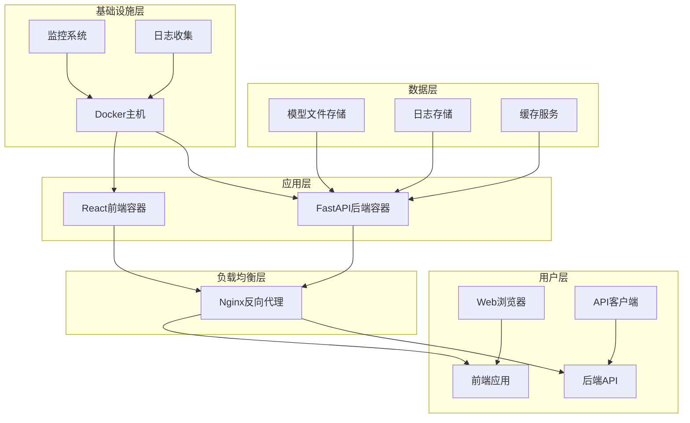

# 部署指南

## 📖 概述

本文档详细介绍了 Transformer 深度学习平台的部署方案，包括开发环境、测试环境和生产环境的部署配置。

## 🏗️ 部署架构

### 整体架构图



## 🚀 快速部署

### 1. 环境准备

#### 系统要求

| 组件 | 最低要求 | 推荐配置 |
|------|----------|----------|
| CPU | 2核心 | 8核心或更多 |
| 内存 | 4GB | 16GB或更多 |
| 存储 | 20GB | 100GB或更多（SSD） |
| 网络 | 100Mbps | 1Gbps或更高 |
| 操作系统 | Ubuntu 20.04+ | Ubuntu 22.04 LTS |

#### 软件依赖

```bash
# 更新系统
sudo apt update && sudo apt upgrade -y

# 安装基础工具
sudo apt install -y curl wget git vim htop

# 安装 Docker
curl -fsSL https://get.docker.com -o get-docker.sh
sudo sh get-docker.sh

# 安装 Docker Compose
sudo curl -L "https://github.com/docker/compose/releases/latest/download/docker-compose-$(uname -s)-$(uname -m)" -o /usr/local/bin/docker-compose
sudo chmod +x /usr/local/bin/docker-compose

# 验证安装
docker --version
docker-compose --version
```

### 2. 项目部署

#### 克隆项目

```bash
# 克隆项目仓库
git clone <repository-url>
cd transformer-platform

# 查看项目结构
ls -la
```

#### 配置环境变量

```bash
# 复制环境配置文件
cp deploy/.env.example deploy/.env

# 编辑配置文件
vim deploy/.env
```

**环境变量配置示例：**

```bash
# 应用配置
DEBUG=false
LOG_LEVEL=INFO

# 后端配置
BACKEND_PORT=8000
DATABASE_URL=sqlite:///./app.db
SECRET_KEY=your-secret-key-change-in-production

# 前端配置
FRONTEND_PORT=3000
NODE_ENV=production

# Nginx配置
NGINX_PORT=80
NGINX_SSL_PORT=443

# 监控配置
PROMETHEUS_PORT=9090
GRAFANA_PORT=3001
```

#### 启动服务

```bash
# 进入部署目录
cd deploy

# 构建并启动所有服务
docker-compose up -d

# 查看服务状态
docker-compose ps

# 查看日志
docker-compose logs -f
```

### 3. 验证部署

```bash
# 检查服务健康状态
curl http://localhost/api/v1/health/health

# 检查前端访问
curl http://localhost:3000

# 检查API文档
curl http://localhost:8000/docs
```

## 🔧 详细配置

### 1. Docker Compose 配置

#### 完整的 docker-compose.yml

```yaml
version: '3.8'

services:
  backend:
    build:
      context: ../backend
      dockerfile: Dockerfile
    container_name: transformer-backend
    ports:
      - "${BACKEND_PORT:-8000}:8000"
    environment:
      - DEBUG=${DEBUG:-false}
      - LOG_LEVEL=${LOG_LEVEL:-INFO}
      - HOST=0.0.0.0
      - PORT=8000
      - DATABASE_URL=${DATABASE_URL:-sqlite:///./app.db}
      - SECRET_KEY=${SECRET_KEY:-your-secret-key-change-in-production}
    volumes:
      - ./logs:/app/logs
      - ./data:/app/data
      - ./models:/app/models
    networks:
      - app-network
    restart: unless-stopped
    healthcheck:
      test: ["CMD", "curl", "-f", "http://localhost:8000/api/v1/health/health"]
      interval: 30s
      timeout: 10s
      retries: 3
      start_period: 40s
    deploy:
      resources:
        limits:
          cpus: '4.0'
          memory: 8G
        reservations:
          cpus: '2.0'
          memory: 4G

  frontend:
    build:
      context: ../frontend
      dockerfile: Dockerfile
    container_name: transformer-frontend
    ports:
      - "${FRONTEND_PORT:-3000}:3000"
    environment:
      - NODE_ENV=production
      - REACT_APP_API_URL=http://localhost:${BACKEND_PORT:-8000}
    depends_on:
      backend:
        condition: service_healthy
    networks:
      - app-network
    restart: unless-stopped
    healthcheck:
      test: ["CMD", "wget", "--no-verbose", "--tries=1", "--spider", "http://localhost:3000"]
      interval: 30s
      timeout: 10s
      retries: 3
      start_period: 40s
    deploy:
      resources:
        limits:
          cpus: '2.0'
          memory: 2G
        reservations:
          cpus: '1.0'
          memory: 1G

  nginx:
    image: nginx:alpine
    container_name: transformer-nginx
    ports:
      - "${NGINX_PORT:-80}:80"
      - "${NGINX_SSL_PORT:-443}:443"
    volumes:
      - ./nginx/nginx.conf:/etc/nginx/nginx.conf:ro
      - ./nginx/ssl:/etc/nginx/ssl:ro
      - ./logs/nginx:/var/log/nginx
    depends_on:
      - frontend
      - backend
    networks:
      - app-network
    restart: unless-stopped
    healthcheck:
      test: ["CMD", "wget", "--no-verbose", "--tries=1", "--spider", "http://localhost/health"]
      interval: 30s
      timeout: 10s
      retries: 3
      start_period: 40s

  # 可选：Redis 缓存
  redis:
    image: redis:alpine
    container_name: transformer-redis
    ports:
      - "6379:6379"
    volumes:
      - redis-data:/data
    networks:
      - app-network
    restart: unless-stopped
    command: redis-server --appendonly yes
    deploy:
      resources:
        limits:
          cpus: '1.0'
          memory: 1G
        reservations:
          cpus: '0.5'
          memory: 512M

  # 可选：监控服务
  prometheus:
    image: prom/prometheus:latest
    container_name: transformer-prometheus
    ports:
      - "${PROMETHEUS_PORT:-9090}:9090"
    volumes:
      - ./monitoring/prometheus.yml:/etc/prometheus/prometheus.yml:ro
      - prometheus-data:/prometheus
    networks:
      - app-network
    restart: unless-stopped
    command:
      - '--config.file=/etc/prometheus/prometheus.yml'
      - '--storage.tsdb.path=/prometheus'
      - '--web.console.libraries=/etc/prometheus/console_libraries'
      - '--web.console.templates=/etc/prometheus/consoles'

  grafana:
    image: grafana/grafana:latest
    container_name: transformer-grafana
    ports:
      - "${GRAFANA_PORT:-3001}:3000"
    environment:
      - GF_SECURITY_ADMIN_PASSWORD=admin123
    volumes:
      - grafana-data:/var/lib/grafana
      - ./monitoring/grafana/dashboards:/etc/grafana/provisioning/dashboards
      - ./monitoring/grafana/datasources:/etc/grafana/provisioning/datasources
    networks:
      - app-network
    restart: unless-stopped
    depends_on:
      - prometheus

networks:
  app-network:
    driver: bridge
    ipam:
      config:
        - subnet: 172.20.0.0/16

volumes:
  redis-data:
    driver: local
  prometheus-data:
    driver: local
  grafana-data:
    driver: local
  logs:
    driver: local
  data:
    driver: local
  models:
    driver: local
```

### 2. Nginx 配置

#### nginx.conf

```nginx
events {
    worker_connections 1024;
}

http {
    include /etc/nginx/mime.types;
    default_type application/octet-stream;

    # 日志格式
    log_format main '$remote_addr - $remote_user [$time_local] "$request" '
                    '$status $body_bytes_sent "$http_referer" '
                    '"$http_user_agent" "$http_x_forwarded_for"';

    access_log /var/log/nginx/access.log main;
    error_log /var/log/nginx/error.log warn;

    # 基础配置
    sendfile on;
    tcp_nopush on;
    tcp_nodelay on;
    keepalive_timeout 65;
    types_hash_max_size 2048;
    client_max_body_size 100M;

    # Gzip 压缩
    gzip on;
    gzip_vary on;
    gzip_min_length 1024;
    gzip_types
        text/plain
        text/css
        text/xml
        text/javascript
        application/javascript
        application/xml+rss
        application/json;

    # 上游服务器配置
    upstream backend {
        server backend:8000;
    }

    upstream frontend {
        server frontend:3000;
    }

    # 主服务器配置
    server {
        listen 80;
        server_name localhost;

        # 安全头
        add_header X-Frame-Options "SAMEORIGIN" always;
        add_header X-XSS-Protection "1; mode=block" always;
        add_header X-Content-Type-Options "nosniff" always;
        add_header Referrer-Policy "no-referrer-when-downgrade" always;
        add_header Content-Security-Policy "default-src 'self' http: https: data: blob: 'unsafe-inline'" always;

        # API 路由
        location /api/ {
            proxy_pass http://backend;
            proxy_set_header Host $host;
            proxy_set_header X-Real-IP $remote_addr;
            proxy_set_header X-Forwarded-For $proxy_add_x_forwarded_for;
            proxy_set_header X-Forwarded-Proto $scheme;
            
            # 超时配置
            proxy_connect_timeout 60s;
            proxy_send_timeout 60s;
            proxy_read_timeout 60s;
            
            # 缓冲配置
            proxy_buffering on;
            proxy_buffer_size 4k;
            proxy_buffers 8 4k;
        }

        # 文档路由
        location /docs {
            proxy_pass http://backend;
            proxy_set_header Host $host;
            proxy_set_header X-Real-IP $remote_addr;
            proxy_set_header X-Forwarded-For $proxy_add_x_forwarded_for;
            proxy_set_header X-Forwarded-Proto $scheme;
        }

        # WebSocket 支持
        location /ws {
            proxy_pass http://backend;
            proxy_http_version 1.1;
            proxy_set_header Upgrade $http_upgrade;
            proxy_set_header Connection "upgrade";
            proxy_set_header Host $host;
            proxy_set_header X-Real-IP $remote_addr;
            proxy_set_header X-Forwarded-For $proxy_add_x_forwarded_for;
            proxy_set_header X-Forwarded-Proto $scheme;
        }

        # 前端应用
        location / {
            proxy_pass http://frontend;
            proxy_set_header Host $host;
            proxy_set_header X-Real-IP $remote_addr;
            proxy_set_header X-Forwarded-For $proxy_add_x_forwarded_for;
            proxy_set_header X-Forwarded-Proto $scheme;
        }

        # 健康检查
        location /health {
            access_log off;
            return 200 "healthy\n";
            add_header Content-Type text/plain;
        }

        # 静态文件缓存
        location ~* \.(js|css|png|jpg|jpeg|gif|ico|svg)$ {
            expires 1y;
            add_header Cache-Control "public, immutable";
        }
    }

    # HTTPS 配置（可选）
    server {
        listen 443 ssl http2;
        server_name localhost;

        ssl_certificate /etc/nginx/ssl/cert.pem;
        ssl_certificate_key /etc/nginx/ssl/key.pem;
        ssl_session_timeout 1d;
        ssl_session_cache shared:MozTLS:10m;
        ssl_session_tickets off;

        ssl_protocols TLSv1.2 TLSv1.3;
        ssl_ciphers ECDHE-ECDSA-AES128-GCM-SHA256:ECDHE-RSA-AES128-GCM-SHA256:ECDHE-ECDSA-AES256-GCM-SHA384:ECDHE-RSA-AES256-GCM-SHA384;
        ssl_prefer_server_ciphers off;

        # 其他配置与 HTTP 相同...
    }
}
```

### 3. 监控配置

#### Prometheus 配置

```yaml
# monitoring/prometheus.yml
global:
  scrape_interval: 15s
  evaluation_interval: 15s

rule_files:
  # - "first_rules.yml"
  # - "second_rules.yml"

scrape_configs:
  - job_name: 'transformer-backend'
    static_configs:
      - targets: ['backend:8000']
    metrics_path: '/metrics'
    scrape_interval: 30s

  - job_name: 'nginx'
    static_configs:
      - targets: ['nginx:9113']
    scrape_interval: 30s

  - job_name: 'prometheus'
    static_configs:
      - targets: ['localhost:9090']
```

#### Grafana 数据源配置

```yaml
# monitoring/grafana/datasources/prometheus.yml
apiVersion: 1

datasources:
  - name: Prometheus
    type: prometheus
    access: proxy
    url: http://prometheus:9090
    isDefault: true
    editable: true
```

## 🚀 生产环境部署

### 1. 服务器配置

#### 系统优化

```bash
# 优化系统参数
echo "vm.max_map_count=262144" >> /etc/sysctl.conf
echo "fs.file-max=65536" >> /etc/sysctl.conf
echo "net.core.somaxconn=65535" >> /etc/sysctl.conf
sysctl -p

# 优化 Docker 配置
sudo mkdir -p /etc/docker
sudo tee /etc/docker/daemon.json > /dev/null <<EOF
{
  "log-driver": "json-file",
  "log-opts": {
    "max-size": "10m",
    "max-file": "3"
  },
  "storage-driver": "overlay2",
  "storage-opts": [
    "overlay2.override_kernel_check=true"
  ]
}
EOF

sudo systemctl restart docker
```

#### 防火墙配置

```bash
# 配置 UFW 防火墙
sudo ufw --force reset
sudo ufw default deny incoming
sudo ufw default allow outgoing

# 允许必要端口
sudo ufw allow 22/tcp      # SSH
sudo ufw allow 80/tcp      # HTTP
sudo ufw allow 443/tcp     # HTTPS

# 启用防火墙
sudo ufw --force enable
```

### 2. SSL 证书配置

#### 使用 Let's Encrypt

```bash
# 安装 Certbot
sudo apt install certbot python3-certbot-nginx

# 获取证书
sudo certbot --nginx -d yourdomain.com

# 自动续期
sudo crontab -e
# 添加以下行：
# 0 12 * * * /usr/bin/certbot renew --quiet
```

#### 手动证书生成

```bash
# 创建 SSL 目录
mkdir -p deploy/nginx/ssl

# 生成自签名证书（开发环境）
openssl req -x509 -nodes -days 365 -newkey rsa:2048 \
    -keyout deploy/nginx/ssl/key.pem \
    -out deploy/nginx/ssl/cert.pem \
    -subj "/C=CN/ST=State/L=City/O=Organization/CN=localhost"
```

### 3. 数据库配置

#### PostgreSQL 配置（可选）

```yaml
# 在 docker-compose.yml 中添加
postgres:
  image: postgres:15
  container_name: transformer-postgres
  environment:
    POSTGRES_DB: transformer
    POSTGRES_USER: transformer
    POSTGRES_PASSWORD: ${POSTGRES_PASSWORD}
  volumes:
    - postgres-data:/var/lib/postgresql/data
    - ./init.sql:/docker-entrypoint-initdb.d/init.sql
  networks:
    - app-network
  restart: unless-stopped
  ports:
    - "5432:5432"

volumes:
  postgres-data:
    driver: local
```

#### 数据库初始化脚本

```sql
-- init.sql
CREATE EXTENSION IF NOT EXISTS "uuid-ossp";

-- 创建应用表
CREATE TABLE IF NOT EXISTS inference_logs (
    id UUID PRIMARY KEY DEFAULT uuid_generate_v4(),
    input_text TEXT NOT NULL,
    output_shape TEXT,
    processing_time FLOAT,
    created_at TIMESTAMP DEFAULT CURRENT_TIMESTAMP
);

-- 创建索引
CREATE INDEX IF NOT EXISTS idx_inference_logs_created_at ON inference_logs(created_at);
```

### 4. 备份策略

#### 自动备份脚本

```bash
#!/bin/bash
# backup.sh

BACKUP_DIR="/backup/transformer"
DATE=$(date +%Y%m%d_%H%M%S)
BACKUP_FILE="backup_${DATE}.tar.gz"

# 创建备份目录
mkdir -p $BACKUP_DIR

# 备份数据
docker run --rm -v transformer-data:/data -v $BACKUP_DIR:/backup alpine tar czf /backup/$BACKUP_FILE -C /data .

# 清理旧备份（保留7天）
find $BACKUP_DIR -name "backup_*.tar.gz" -mtime +7 -delete

echo "Backup completed: $BACKUP_FILE"
```

#### 设置定时备份

```bash
# 添加到 crontab
crontab -e

# 每天凌晨2点备份
0 2 * * * /path/to/backup.sh >> /var/log/backup.log 2>&1
```

## 🛠️ 运维管理

### 1. 服务管理

#### 启动和停止服务

```bash
# 启动所有服务
docker-compose up -d

# 停止所有服务
docker-compose down

# 重启特定服务
docker-compose restart backend

# 查看服务状态
docker-compose ps

# 查看资源使用
docker stats
```

#### 日志管理

```bash
# 查看所有服务日志
docker-compose logs

# 查看特定服务日志
docker-compose logs backend

# 实时跟踪日志
docker-compose logs -f

# 日志轮转配置
sudo vim /etc/logrotate.d/docker-containers
```

### 2. 性能监控

#### 系统监控脚本

```bash
#!/bin/bash
# monitor.sh

echo "=== 系统资源使用情况 ==="
echo "CPU 使用率："
top -bn1 | grep "Cpu(s)" | awk '{print $2}' | cut -d'%' -f1

echo "内存使用情况："
free -h

echo "磁盘使用情况："
df -h

echo "=== Docker 容器状态 ==="
docker-compose ps

echo "=== 网络连接情况 ==="
netstat -tuln | grep -E ':(80|443|8000|3000)'
```

#### 性能测试

```bash
# API 性能测试
ab -n 1000 -c 10 http://localhost/api/v1/health/health

# 前端性能测试
ab -n 1000 -c 10 http://localhost:3000/
```

### 3. 故障排除

#### 常见问题解决

```bash
# 1. 容器启动失败
docker-compose logs <service-name>
docker inspect <container-name>

# 2. 端口冲突
sudo netstat -tuln | grep <port>
sudo lsof -i :<port>

# 3. 磁盘空间不足
df -h
docker system prune -a

# 4. 内存不足
free -h
docker stats --no-stream

# 5. 网络问题
docker network ls
docker network inspect <network-name>
```

#### 健康检查脚本

```bash
#!/bin/bash
# health-check.sh

SERVICES=("backend:8000" "frontend:3000" "nginx:80")

for service in "${SERVICES[@]}"; do
    IFS=':' read -r name port <<< "$service"
    
    if curl -f http://localhost:$port/api/v1/health/health > /dev/null 2>&1; then
        echo "✅ $name is healthy"
    else
        echo "❌ $name is unhealthy"
        # 发送告警
        # send_alert "$name is down"
    fi
done
```

## 🔒 安全配置

### 1. 网络安全

#### 防火墙规则

```bash
# 只允许特定IP访问管理端口
sudo ufw allow from 192.168.1.0/24 to any port 22
sudo ufw allow from 192.168.1.0/24 to any port 9090
sudo ufw allow from 192.168.1.0/24 to any port 3001
```

#### Docker 安全配置

```yaml
# 在 docker-compose.yml 中添加安全配置
services:
  backend:
    security_opt:
      - no-new-privileges:true
    read_only: true
    tmpfs:
      - /tmp
    user: "1000:1000"
```

### 2. 应用安全

#### 环境变量加密

```bash
# 使用 Docker secrets（Docker Swarm）
echo "your-secret-key" | docker secret create db_password -

# 或使用环境文件加密
gpg --symmetric --cipher-algo AES256 .env
```

#### API 限流

```python
# 在 FastAPI 中添加限流中间件
from slowapi import Limiter, _rate_limit_exceeded_handler
from slowapi.util import get_remote_address

limiter = Limiter(key_func=get_remote_address)
app.state.limiter = limiter
app.add_exception_handler(429, _rate_limit_exceeded_handler)

@app.get("/api/v1/forward")
@limiter.limit("10/minute")
async def forward(request: Request, ...):
    # API 实现
    pass
```

## 📈 扩展部署

### 1. 多节点部署

#### Docker Swarm 配置

```bash
# 初始化 Swarm
docker swarm init --advertise-addr <MANAGER-IP>

# 部署堆栈
docker stack deploy -c docker-compose.yml transformer

# 查看服务状态
docker service ls
docker service ps transformer_backend
```

#### Kubernetes 配置

```yaml
# k8s/deployment.yaml
apiVersion: apps/v1
kind: Deployment
metadata:
  name: transformer-backend
spec:
  replicas: 3
  selector:
    matchLabels:
      app: transformer-backend
  template:
    metadata:
      labels:
        app: transformer-backend
    spec:
      containers:
      - name: backend
        image: transformer-backend:latest
        ports:
        - containerPort: 8000
        env:
        - name: DATABASE_URL
          valueFrom:
            secretKeyRef:
              name: transformer-secrets
              key: database-url
        resources:
          requests:
            memory: "2Gi"
            cpu: "1000m"
          limits:
            memory: "4Gi"
            cpu: "2000m"
```

### 2. 负载均衡

#### HAProxy 配置

```
# haproxy.cfg
global
    daemon
    maxconn 4096

defaults
    mode http
    timeout connect 5000ms
    timeout client 50000ms
    timeout server 50000ms

frontend transformer_frontend
    bind *:80
    default_backend transformer_backend

backend transformer_backend
    balance roundrobin
    option httpchk GET /api/v1/health/health
    server backend1 backend1:8000 check
    server backend2 backend2:8000 check
    server backend3 backend3:8000 check
```

## 📝 最佳实践

### 1. 部署清单

- [ ] 系统资源检查
- [ ] 依赖软件安装
- [ ] 网络配置
- [ ] 安全配置
- [ ] 监控设置
- [ ] 备份策略
- [ ] 日志配置
- [ ] 性能测试
- [ ] 故障恢复测试

### 2. 监控指标

| 指标类型 | 关键指标 | 告警阈值 |
|----------|----------|----------|
| 系统资源 | CPU 使用率 | > 80% |
| 系统资源 | 内存使用率 | > 85% |
| 系统资源 | 磁盘使用率 | > 90% |
| 应用性能 | 响应时间 | > 2s |
| 应用性能 | 错误率 | > 5% |
| 应用可用性 | 服务可用性 | < 99% |

### 3. 运维脚本

```bash
#!/bin/bash
# deploy.sh - 一键部署脚本

set -e

echo "开始部署 Transformer 平台..."

# 检查环境
check_environment() {
    echo "检查环境..."
    docker --version || { echo "Docker 未安装"; exit 1; }
    docker-compose --version || { echo "Docker Compose 未安装"; exit 1; }
}

# 构建镜像
build_images() {
    echo "构建镜像..."
    docker-compose build --no-cache
}

# 启动服务
start_services() {
    echo "启动服务..."
    docker-compose up -d
}

# 等待服务就绪
wait_for_services() {
    echo "等待服务就绪..."
    sleep 30
    
    for i in {1..10}; do
        if curl -f http://localhost/api/v1/health/health > /dev/null 2>&1; then
            echo "服务已就绪"
            return 0
        fi
        echo "等待服务启动... ($i/10)"
        sleep 10
    done
    
    echo "服务启动超时"
    exit 1
}

# 运行健康检查
health_check() {
    echo "运行健康检查..."
    ./health-check.sh
}

# 主流程
main() {
    check_environment
    build_images
    start_services
    wait_for_services
    health_check
    echo "部署完成！"
}

main "$@"
```

---

💡 **提示**：在生产环境部署前，建议先在测试环境中完整验证所有配置和流程。