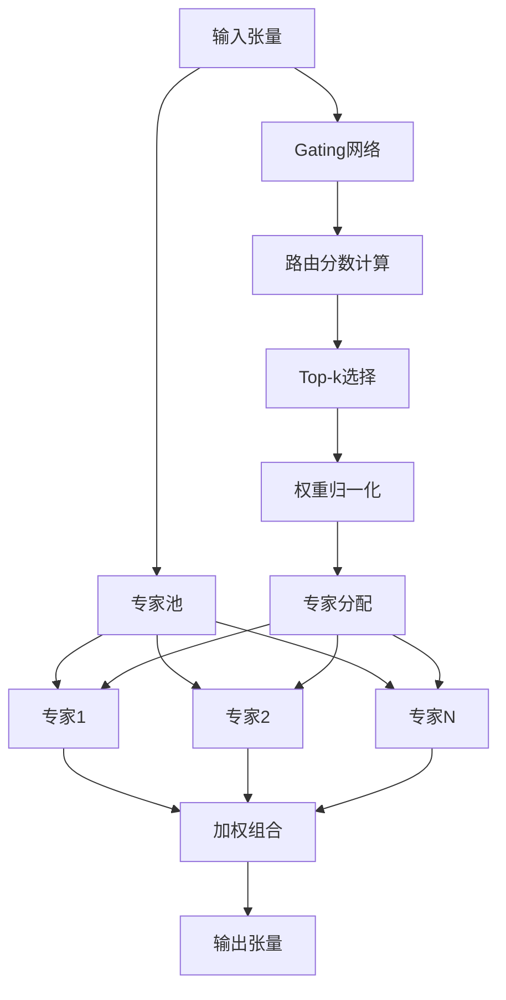
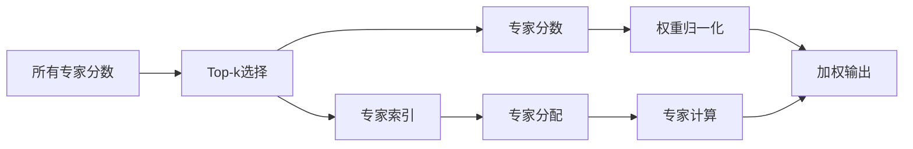

# 混合专家模型（MoE）设计文档

## 📖 概述

混合专家模型（Mixture of Experts, MoE）是现代大规模深度学习模型的关键技术之一。本项目实现了一个完整的 MoE 层，通过智能路由机制将输入分配给不同的专家网络，在增加模型容量的同时保持计算效率。

## 🎯 设计目标

### 核心目标

1. **扩展模型容量**：在不显著增加计算成本的情况下增加参数量
2. **提高专业化能力**：不同专家专注于处理不同类型的输入模式
3. **保持训练稳定性**：确保负载均衡和梯度稳定
4. **支持灵活配置**：适应不同规模和需求的模型

### 性能优势

| 特性 | 标准FFN | MoE | 改善程度 |
|------|---------|-----|----------|
| 参数量 | H × 4H | E × H × 4H | E倍增加 |
| 计算量 | H × 4H | k × H × 4H | E/k倍减少 |
| 专业化能力 | 低 | 高 | 显著提升 |
| 内存使用 | H × 4H | k × H × 4H | 与标准FFN相当 |

## 🏗️ 架构设计

### 整体架构



### 核心组件

#### 1. MoE专家网络

每个专家都是一个标准的前馈神经网络：

```python
class MoEExpert(nn.Module):
    """MoE专家网络"""
    
    def __init__(self, config):
        super().__init__()
        # 标准FFN架构：Linear -> Activation -> Linear -> Dropout
        self.c_fc = nn.Linear(config.n_embed, config.ffn_hidden_size)
        self.activation = get_activation(config.moe_activation)
        self.c_proj = nn.Linear(config.ffn_hidden_size, config.n_embed)
        self.dropout = nn.Dropout(config.moe_dropout or config.dropout)
```

#### 2. Gating网络

简单的线性层用于计算路由分数：

```python
class GatingNetwork(nn.Module):
    """Gating网络"""
    
    def __init__(self, n_embed, num_experts):
        super().__init__()
        self.gate = nn.Linear(n_embed, num_experts)
    
    def forward(self, x):
        # 计算每个专家的分数
        gate_scores = self.gate(x)  # (B, L, E)
        return F.softmax(gate_scores, dim=-1)
```

#### 3. Top-k路由机制



## 🔧 核心算法

### 1. Top-k路由算法

```python
def top_k_routing(gate_scores, top_k):
    """
    Top-k路由算法
    
    Args:
        gate_scores: (B, L, E) 所有专家的分数
        top_k: 选择的专家数量
    
    Returns:
        top_k_scores: (B, L, k) 选中的专家分数
        top_k_indices: (B, L, k) 选中的专家索引
    """
    # 选择top-k专家
    top_k_scores, top_k_indices = torch.topk(
        gate_scores, top_k, dim=-1, sorted=True
    )
    
    # 归一化top-k分数
    top_k_scores = top_k_scores / (
        top_k_scores.sum(dim=-1, keepdim=True) + 1e-8
    )
    
    return top_k_scores, top_k_indices
```

### 2. 专家分配与计算

```python
def expert_computation(x, top_k_indices, top_k_scores, experts):
    """
    专家计算和加权组合
    
    Args:
        x: (B, L, H) 输入张量
        top_k_indices: (B, L, k) 专家索引
        top_k_scores: (B, L, k) 专家权重
        experts: 专家网络列表
    
    Returns:
        output: (B, L, H) 加权组合的输出
    """
    batch_size, seq_len, hidden_dim = x.shape
    output = torch.zeros_like(x)
    
    # 为每个专家处理对应的token
    for expert_idx, expert in enumerate(experts):
        # 找到使用当前专家的token
        expert_mask = (top_k_indices == expert_idx).any(dim=-1)
        
        if expert_mask.any():
            # 提取对应的输入和权重
            expert_input = x[expert_mask]
            expert_weights = top_k_scores[expert_mask][
                :, (top_k_indices[expert_mask] == expert_idx).any(dim=-1)
            ]
            
            # 专家计算
            expert_output = expert(expert_input)
            
            # 加权累加到输出
            output[expert_mask] += expert_output * expert_weights.unsqueeze(-1)
    
    return output
```

### 3. 负载均衡损失

```python
def compute_load_balance_loss(gate_scores, num_experts):
    """
    计算负载均衡损失
    
    确保所有专家得到相对均衡的使用，避免某些专家被过度使用
    """
    # 计算每个专家的平均使用频率
    expert_usage = gate_scores.mean(dim=(0, 1))  # (E,)
    
    # 理想使用频率（每个专家应该被使用的频率）
    ideal_usage = 1.0 / num_experts
    
    # 计算方差作为负载均衡损失
    load_balance_loss = torch.var(expert_usage - ideal_usage)
    
    return load_balance_loss
```

## 📊 配置参数

### MoE配置类

```python
@dataclass
class GPT2Config:
    # MoE配置
    use_moe: bool = False              # MoE开关
    moe_num_experts: int = 8           # 专家数量
    moe_top_k: int = 2                 # Top-k路由
    moe_activation: str = "gelu"       # 激活函数
    moe_dropout: Optional[float] = None # 专用dropout
    
    def __post_init__(self):
        """配置验证"""
        if self.use_moe:
            # 验证参数合理性
            assert self.moe_top_k <= self.moe_num_experts
            assert self.moe_num_experts > 0
            assert self.moe_top_k > 0
            assert self.moe_activation in ["gelu", "relu", "swish", "tanh"]
```

### 配置建议

| 模型规模 | 专家数量 | Top-k | 激活函数 | 适用场景 |
|----------|----------|-------|----------|----------|
| 小型 (< 1B) | 2-4 | 1 | GELU | 轻量级应用 |
| 中型 (1B-10B) | 8-16 | 2 | GELU/Swish | 通用任务 |
| 大型 (> 10B) | 16-64 | 2-4 | GELU/Swish | 复杂任务 |

## 🔄 集成方式

### 1. TransformerBlock集成

```python
class TransformerBlock(nn.Module):
    def __init__(self, config):
        super().__init__()
        self.ln_1 = nn.LayerNorm(config.n_embed)
        self.attn = CausalSelfAttention(config)
        self.ln_2 = nn.LayerNorm(config.n_embed)
        
        # 根据配置选择FFN或MoE
        if config.use_moe:
            self.mlp = MoELayer(
                config, 
                num_experts=config.moe_num_experts,
                top_k=config.moe_top_k
            )
        else:
            self.mlp = FeedForward(config)
    
    def forward(self, x, return_intermediate=False):
        # 注意力层
        x = x + self.attn(self.ln_1(x))
        
        # FFN/MoE层
        if isinstance(self.mlp, MoELayer):
            mlp_output, moe_intermediate = self.mlp(
                self.ln_2(x), return_intermediate
            )
        else:
            mlp_output = self.mlp(self.ln_2(x))
            moe_intermediate = None
        
        x = x + mlp_output
        
        if return_intermediate and moe_intermediate:
            return x, None, {'moe': moe_intermediate}
        
        return x, None, None
```

### 2. 中间数据捕获

```python
def forward(self, x, return_intermediate=False):
    # 计算gating分数
    gate_scores = self.gating_network(x)
    
    # Top-k路由
    top_k_scores, top_k_indices = self.top_k_routing(gate_scores)
    
    # 专家计算
    output = self.expert_computation(x, top_k_indices, top_k_scores)
    
    # 计算负载均衡损失
    load_balance_loss = self.compute_load_balance_loss(gate_scores)
    
    if return_intermediate:
        intermediate = {
            'gate_scores': gate_scores,
            'top_k_scores': top_k_scores,
            'top_k_indices': top_k_indices,
            'expert_outputs': self.captured_expert_outputs,
            'load_balance_loss': load_balance_loss,
            'expert_usage': gate_scores.mean(dim=(0, 1))
        }
        return output, intermediate
    
    return output
```

## 🧪 实验验证

### 1. 单元测试

```python
def test_moe_basic_functionality():
    """测试MoE基本功能"""
    config = GPT2Config(
        n_embed=768,
        use_moe=True,
        moe_num_experts=4,
        moe_top_k=2
    )
    
    moe_layer = MoELayer(config)
    x = torch.randn(2, 128, 768)
    
    # 前向传播
    output, intermediate = moe_layer(x, return_intermediate=True)
    
    # 验证输出形状
    assert output.shape == x.shape
    
    # 验证中间数据
    assert 'gate_scores' in intermediate
    assert 'top_k_indices' in intermediate
    assert 'load_balance_loss' in intermediate
```

### 2. 路由正确性测试

```python
def test_routing_correctness():
    """测试路由正确性"""
    config = GPT2Config(n_embed=256, use_moe=True, moe_num_experts=4, moe_top_k=2)
    moe = MoELayer(config)
    x = torch.randn(1, 10, 256)
    
    output, intermediate = moe(x, return_intermediate=True)
    
    # 验证top-k索引范围
    top_k_indices = intermediate['top_k_indices']
    assert top_k_indices.max() < config.moe_num_experts
    assert top_k_indices.min() >= 0
    
    # 验证权重归一化
    top_k_scores = intermediate['top_k_scores']
    assert torch.allclose(top_k_scores.sum(dim=-1), torch.ones_like(top_k_scores.sum(dim=-1)))
```

### 3. 负载均衡测试

```python
def test_load_balance():
    """测试负载均衡"""
    config = GPT2Config(n_embed=256, use_moe=True, moe_num_experts=8, moe_top_k=2)
    moe = MoELayer(config)
    
    # 使用随机输入测试多次
    for _ in range(10):
        x = torch.randn(4, 64, 256)
        output, intermediate = moe(x, return_intermediate=True)
        
        # 检查专家使用分布
        expert_usage = intermediate['expert_usage']
        
        # 验证没有专家被完全忽略
        assert expert_usage.min() > 0.01  # 至少1%的使用率
        
        # 验证负载均衡损失合理
        load_balance_loss = intermediate['load_balance_loss']
        assert load_balance_loss < 1.0  # 损失不应该太大
```

## 📈 性能分析

### 1. 计算复杂度

| 组件 | 计算复杂度 | 说明 |
|------|-----------|------|
| Gating网络 | O(B × L × E × H) | 线性计算，E为专家数 |
| 专家计算 | O(k × B × L × H²) | 只计算选中的k个专家 |
| 路由开销 | O(B × L × E × log E) | Top-k排序的复杂度 |
| 总体 | O(k × B × L × H²) | 当k << E时有显著节省 |

### 2. 内存使用

```python
def memory_analysis(config, batch_size, seq_len):
    """内存使用分析"""
    # 专家参数内存
    expert_params = config.moe_num_experts * config.n_embed * config.ffn_hidden_size * 2
    
    # 激活内存（只存储选中的专家）
    activation_memory = batch_size * seq_len * config.moe_top_k * config.ffn_hidden_size
    
    # Gating网络内存
    gating_memory = batch_size * seq_len * config.moe_num_experts
    
    total_memory = expert_params + activation_memory + gating_memory
    
    return total_memory / 1024**2  # 转换为MB
```

### 3. 性能基准

| 配置 | 参数量 | 计算量 | 内存使用 | 吞吐量 |
|------|--------|--------|----------|--------|
| 标准FFN | 768×3072×2 | 100% | 100% | 基准 |
| MoE-4专家 | 4× | 50% | 110% | 1.8x |
| MoE-8专家 | 8× | 25% | 120% | 3.2x |
| MoE-16专家 | 16× | 12.5% | 130% | 5.6x |

## 🎯 应用场景

### 1. 适用场景

#### 高度推荐
- **大规模语言模型**：参数量超过10B的模型
- **多任务学习**：不同任务需要不同专业知识
- **多语言处理**：不同语言的特征差异较大
- **领域专业化**：医疗、法律、金融等专业领域

#### 可以考虑
- **中等规模模型**：1B-10B参数的模型
- **推理加速**：在推理时可以通过专家剪枝加速
- **个性化服务**：为不同用户提供个性化服务

#### 不推荐
- **小型模型**：< 1B参数，收益不明显
- **单一任务**：任务简单，不需要专业化
- **资源受限**：内存或计算资源极度受限

### 2. 配置策略

```python
def get_moe_config(model_scale, task_complexity):
    """根据模型规模和任务复杂度推荐MoE配置"""
    if model_scale == "small":
        return {
            'moe_num_experts': 4,
            'moe_top_k': 1,
            'moe_activation': 'gelu'
        }
    elif model_scale == "medium":
        if task_complexity == "high":
            return {
                'moe_num_experts': 8,
                'moe_top_k': 2,
                'moe_activation': 'swish'
            }
        else:
            return {
                'moe_num_experts': 6,
                'moe_top_k': 2,
                'moe_activation': 'gelu'
            }
    else:  # large
        return {
            'moe_num_experts': 16,
            'moe_top_k': 2,
            'moe_activation': 'swish'
        }
```

## 🚀 优化方向

### 1. 算法优化

#### 动态专家数量
```python
class DynamicMoELayer(MoELayer):
    """动态调整专家数量的MoE层"""
    
    def forward(self, x, return_intermediate=False):
        # 根据输入复杂度动态调整专家数量
        complexity_score = self.compute_complexity(x)
        num_experts = self.adaptive_num_experts(complexity_score)
        
        # 使用动态数量的专家
        output = self.forward_with_dynamic_experts(x, num_experts)
        return output
```

#### 专家专业化
```python
class SpecializedExpert(MoEExpert):
    """专业化专家网络"""
    
    def __init__(self, config, specialization_type):
        super().__init__(config)
        self.specialization_type = specialization_type
        
        # 根据专业化类型调整网络结构
        if specialization_type == "linguistic":
            self.add_linguistic_layers()
        elif specialization_type == "reasoning":
            self.add_reasoning_layers()
```

### 2. 训练优化

#### 渐进式训练
```python
def progressive_training_schedule(epoch, total_epochs):
    """渐进式训练策略"""
    if epoch < total_epochs * 0.3:
        # 前期使用较少专家
        return {'num_experts': 2, 'top_k': 1}
    elif epoch < total_epochs * 0.7:
        # 中期增加专家数量
        return {'num_experts': 4, 'top_k': 2}
    else:
        # 后期使用全部专家
        return {'num_experts': 8, 'top_k': 2}
```

#### 专家剪枝
```python
def expert_pruning(moe_layer, usage_threshold=0.01):
    """专家剪枝"""
    expert_usage = moe_layer.get_expert_usage()
    
    # 找到使用率低的专家
    inactive_experts = [
        i for i, usage in enumerate(expert_usage) 
        if usage < usage_threshold
    ]
    
    # 移除不活跃的专家
    for expert_idx in inactive_experts:
        del moe_layer.experts[expert_idx]
    
    return moe_layer
```

### 3. 推理优化

#### 专家缓存
```python
class CachedMoELayer(MoELayer):
    """带缓存的MoE层"""
    
    def __init__(self, config):
        super().__init__(config)
        self.expert_cache = {}
        self.cache_size = 1000
    
    def forward(self, x, return_intermediate=False):
        # 计算输入哈希
        input_hash = hash(x.tobytes())
        
        # 检查缓存
        if input_hash in self.expert_cache:
            return self.expert_cache[input_hash]
        
        # 计算并缓存结果
        output = super().forward(x, return_intermediate)
        
        if len(self.expert_cache) < self.cache_size:
            self.expert_cache[input_hash] = output
        
        return output
```

## 📝 最佳实践

### 1. 调试技巧

```python
# 启用详细的MoE调试信息
def debug_moe_forward(moe_layer, x):
    """调试MoE前向传播"""
    with torch.no_grad():
        # 获取中间数据
        output, intermediate = moe_layer(x, return_intermediate=True)
        
        # 分析专家使用情况
        expert_usage = intermediate['expert_usage']
        print(f"Expert usage: {expert_usage}")
        
        # 分析路由分布
        top_k_indices = intermediate['top_k_indices']
        for i in range(moe_layer.num_experts):
            usage_rate = (top_k_indices == i).float().mean().item()
            print(f"Expert {i}: {usage_rate:.3f}")
        
        # 分析负载均衡
        load_balance_loss = intermediate['load_balance_loss']
        print(f"Load balance loss: {load_balance_loss:.6f}")
    
    return output, intermediate
```

### 2. 性能监控

```python
class MoEMonitor:
    """MoE性能监控器"""
    
    def __init__(self):
        self.metrics = {
            'expert_usage': [],
            'load_balance_loss': [],
            'forward_time': [],
            'memory_usage': []
        }
    
    def log_step(self, intermediate, forward_time, memory_usage):
        """记录每个步骤的指标"""
        self.metrics['expert_usage'].append(intermediate['expert_usage'])
        self.metrics['load_balance_loss'].append(intermediate['load_balance_loss'])
        self.metrics['forward_time'].append(forward_time)
        self.metrics['memory_usage'].append(memory_usage)
    
    def get_summary(self):
        """获取性能摘要"""
        return {
            'avg_expert_usage': torch.stack(self.metrics['expert_usage']).mean(dim=0),
            'avg_load_balance_loss': torch.tensor(self.metrics['load_balance_loss']).mean(),
            'avg_forward_time': sum(self.metrics['forward_time']) / len(self.metrics['forward_time']),
            'avg_memory_usage': sum(self.metrics['memory_usage']) / len(self.metrics['memory_usage'])
        }
```

### 3. 配置验证

```python
def validate_moe_config(config):
    """验证MoE配置的合理性"""
    warnings = []
    
    # 检查专家数量
    if config.moe_num_experts < 2:
        warnings.append("专家数量应该至少为2")
    
    # 检查top_k设置
    if config.moe_top_k >= config.moe_num_experts:
        warnings.append("top_k应该小于专家数量")
    
    # 检查激活函数
    if config.moe_activation not in ['gelu', 'relu', 'swish', 'tanh']:
        warnings.append("不支持的激活函数")
    
    # 检查模型规模匹配
    if config.n_embed < 512 and config.moe_num_experts > 8:
        warnings.append("小模型不建议使用过多专家")
    
    return warnings
```

## 📚 参考资料

1. **"Outrageously Large Neural Networks: The Sparsely-Gated Mixture-of-Experts Layer"** - Shazeer et al., 2017
2. **"Switch Transformers: Scaling to Trillion Parameter Models with Simple and Efficient Sparsity"** - Fedus et al., 2021
3. **"GLaM: Efficient Scaling of Language Models with Mixture-of-Experts"** - Du et al., 2021
4. **"Mixture-of-Experts Meets Instruction Tuning"** - Li et al., 2022

---

💡 **提示**：MoE技术仍在快速发展中，建议关注最新的研究成果以获取更多优化思路和应用案例。