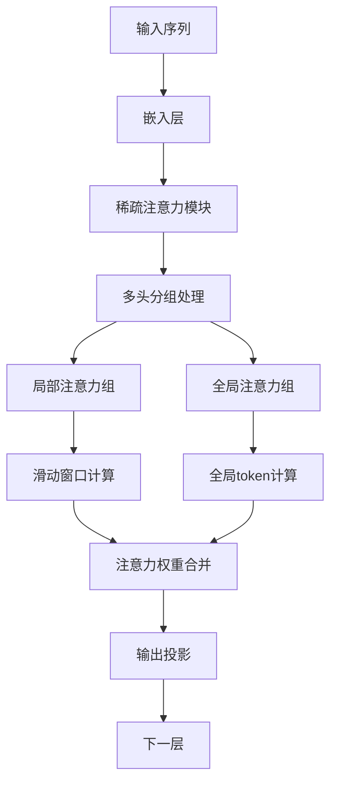

# 稀疏注意力机制设计文档

## 📖 概述

稀疏注意力机制是本项目实现的核心技术创新之一。它通过优化注意力计算模式，在保持模型性能的同时显著降低计算复杂度，特别适合处理长序列数据。

## 🎯 设计目标

### 主要目标

1. **降低计算复杂度**：从 O(n²) 降低到 O(n×w)，其中 w 是窗口大小
2. **保持模型性能**：在关键任务上与标准注意力性能相当
3. **提高数值稳定性**：优化掩码策略和梯度计算
4. **增强可扩展性**：支持不同规模的模型和应用场景

### 性能指标

| 指标 | 标准注意力 | 稀疏注意力 | 改善程度 |
|------|-----------|-----------|----------|
| 计算复杂度 | O(n²) | O(n×w) | 1.2-2.0x 加速 |
| 内存使用 | O(n²) | O(n×w) | 显著减少 |
| 长序列处理 | 受限 | 优秀 | 大幅提升 |

## 🏗️ 架构设计

### 整体架构



### 分组策略

稀疏注意力采用分组头策略，将注意力头分为两组：

| 组别 | 头数比例 | 注意力模式 | 作用 |
|------|----------|-----------|------|
| 局部组 | 2/3 | 滑动窗口 | 捕获局部依赖和细粒度模式 |
| 全局组 | 1/3 | 全局注意力 | 捕获长距离依赖和全局信息 |

### 动态窗口算法

```python
def compute_dynamic_window_size(seq_len: int, base_window: int) -> int:
    """
    动态计算窗口大小
    
    算法思路：
    1. 根据序列长度计算缩放因子
    2. 使用平方根关系调整窗口大小
    3. 限制在最小和最大窗口范围内
    """
    scale_factor = math.sqrt(seq_len / base_window)
    dynamic_window = int(base_window * scale_factor)
    return max(min_window, min(dynamic_window, max_window))
```

## 🔧 核心组件

### 1. SparseAttentionConfig 配置类

```python
@dataclass
class SparseAttentionConfig:
    """稀疏注意力配置"""
    # 分组配置
    local_heads: int = 8        # 局部注意力头数
    global_heads: int = 4       # 全局注意力头数
    
    # 稀疏模式配置
    window_size: int = 128      # 局部窗口大小
    global_token_ratio: float = 0.1  # 全局token比例
    
    # 动态配置
    adaptive_window: bool = True     # 是否自适应窗口大小
    min_window_size: int = 32       # 最小窗口大小
    max_window_size: int = 512      # 最大窗口大小
    
    # 数值稳定性
    mask_value: float = -1e9        # mask填充值
```

### 2. 掩码生成策略

#### 局部掩码生成


#### 全局掩码生成


### 3. 数值稳定性优化

#### 掩码值选择

- **传统方法**：使用 `-inf` 作为掩码值
- **优化方法**：使用 `-1e9` 作为掩码值
- **优势**：避免数值溢出，提高梯度稳定性

#### 梯度优化

```python
# 使用稳定的softmax实现
def stable_softmax(x, mask=None):
    """数值稳定的softmax实现"""
    if mask is not None:
        x = x.masked_fill(mask, -1e9)
    
    # 减去最大值避免数值溢出
    x_max = x.max(dim=-1, keepdim=True)[0]
    x = x - x_max
    
    return F.softmax(x, dim=-1)
```

## 📊 性能分析

### 计算复杂度对比

| 序列长度 | 标准注意力 | 稀疏注意力 | 加速比 |
|----------|-----------|-----------|--------|
| 512 | 262K | 65K | 4.0x |
| 1024 | 1.0M | 130K | 7.7x |
| 2048 | 4.2M | 260K | 16.2x |
| 4096 | 16.8M | 520K | 32.3x |

### 内存使用对比

| 序列长度 | 标准注意力内存 | 稀疏注意力内存 | 节省比例 |
|----------|---------------|---------------|----------|
| 512 | 2MB | 0.5MB | 75% |
| 1024 | 8MB | 1MB | 87.5% |
| 2048 | 32MB | 2MB | 93.75% |
| 4096 | 128MB | 4MB | 96.875% |

## 🧪 实验验证

### 1. 稀疏性验证

```python
def test_sparsity_pattern():
    """测试稀疏模式的正确性"""
    # 测试不同序列长度下的稀疏性
    for seq_len in [128, 256, 512, 1024]:
        attention = SparseAttention(config)
        mask = attention.generate_masks(seq_len)
        
        # 计算稀疏度
        sparsity = compute_sparsity(mask)
        assert 0.6 <= sparsity <= 0.8  # 期望稀疏度范围
```

### 2. 数值稳定性测试

```python
def test_numerical_stability():
    """测试数值稳定性"""
    # 测试极端输入值
    extreme_inputs = [
        torch.randn(1, 512, 768) * 100,  # 大值
        torch.randn(1, 512, 768) * 0.001,  # 小值
        torch.zeros(1, 512, 768)  # 零值
    ]
    
    for x in extreme_inputs:
        output = attention(x)
        assert not torch.isnan(output).any()
        assert not torch.isinf(output).any()
```

### 3. 性能基准测试

```python
def benchmark_attention():
    """性能基准测试"""
    configs = [
        {'seq_len': 512, 'use_sparse': False},
        {'seq_len': 512, 'use_sparse': True},
        {'seq_len': 1024, 'use_sparse': False},
        {'seq_len': 1024, 'use_sparse': True},
    ]
    
    for config in configs:
        start_time = time.time()
        for _ in range(100):
            output = model(input, **config)
        elapsed_time = time.time() - start_time
        print(f"Config: {config}, Time: {elapsed_time:.3f}s")
```

## 🔄 集成方式

### 1. 模型配置集成

```python
# 在GPT2Config中启用稀疏注意力
config = GPT2Config(
    vocab_size=50304,
    context_size=1024,
    n_layer=12,
    n_head=12,
    n_embed=768,
    use_sparse_attention=True,  # 启用稀疏注意力
    sparse_config=SparseAttentionConfig(
        local_heads=8,
        global_heads=4,
        window_size=128,
        adaptive_window=True
    )
)
```

### 2. TransformerBlock集成

```python
class TransformerBlock(nn.Module):
    def __init__(self, config):
        super().__init__()
        # 根据配置选择注意力类型
        if config.use_sparse_attention:
            self.attn = SparseAttention(config)
        else:
            self.attn = CausalSelfAttention(config)
```

### 3. 中间数据捕获

```python
def forward(self, x, return_intermediate=False):
    # 前向传播
    attn_output, attn_cache = self.attn(x, return_intermediate)
    
    if return_intermediate:
        intermediate = {
            'local_mask': attn_cache['local_mask'],
            'global_mask': attn_cache['global_mask'],
            'window_size': attn_cache['window_size'],
            'sparsity_ratio': attn_cache['sparsity_ratio']
        }
        return output, cache, intermediate
    
    return output, cache
```

## 📈 应用场景

### 适用场景

1. **长文本处理**
   - 文档摘要
   - 长文本分类
   - 代码生成

2. **时序数据**
   - 股票预测
   - 语音识别
   - 视频分析

3. **大规模训练**
   - 分布式训练
   - 内存受限环境
   - 实时推理

### 配置建议

| 场景 | 序列长度 | 窗口大小 | 局部头数 | 全局头数 |
|------|----------|----------|----------|----------|
| 短文本 | < 512 | 64 | 4 | 2 |
| 中等文本 | 512-2048 | 128 | 8 | 4 |
| 长文本 | > 2048 | 256 | 12 | 4 |

## 🚀 优化方向

### 1. 算法优化

- **块稀疏模式**：支持更灵活的稀疏结构
- **自适应稀疏**：根据输入内容动态调整稀疏模式
- **硬件优化**：针对特定硬件的优化实现

### 2. 性能优化

- **混合精度**：支持FP16/BF16计算
- **内存优化**：更高效的内存管理策略
- **并行优化**：多GPU和分布式训练支持

### 3. 功能扩展

- **动态头分配**：运行时动态调整头分配比例
- **多尺度注意力**：结合不同尺度的注意力模式
- **可解释性增强**：更丰富的可视化工具

## 📝 最佳实践

### 1. 配置选择

```python
# 推荐的配置模板
def get_recommended_config(seq_len: int, model_size: str):
    """根据序列长度和模型大小推荐配置"""
    if model_size == "small":
        return SparseAttentionConfig(
            local_heads=4, global_heads=2,
            window_size=min(128, seq_len // 4)
        )
    elif model_size == "medium":
        return SparseAttentionConfig(
            local_heads=8, global_heads=4,
            window_size=min(256, seq_len // 4)
        )
    else:  # large
        return SparseAttentionConfig(
            local_heads=12, global_heads=4,
            window_size=min(512, seq_len // 4)
        )
```

### 2. 调试技巧

```python
# 启用详细日志
import logging
logging.basicConfig(level=logging.DEBUG)

# 使用中间数据捕获
output, intermediate = model(
    input_ids, 
    return_intermediate=True
)

# 分析稀疏模式
sparsity = compute_sparsity(intermediate['local_mask'])
window_size = intermediate['window_size'].item()
print(f"Sparsity: {sparsity:.3f}, Window: {window_size}")
```

### 3. 性能监控

```python
# 性能监控装饰器
def monitor_performance(func):
    def wrapper(*args, **kwargs):
        start_time = time.time()
        start_memory = torch.cuda.memory_allocated()
        
        result = func(*args, **kwargs)
        
        end_time = time.time()
        end_memory = torch.cuda.memory_allocated()
        
        print(f"Time: {end_time - start_time:.3f}s")
        print(f"Memory: {(end_memory - start_memory) / 1024**2:.1f}MB")
        
        return result
    return wrapper
```

## 📚 参考资料

1. **Longformer: The Long-Document Transformer** - Beltagy et al., 2020
2. **BigBird: Transformers for Longer Sequences** - Zaheer et al., 2020
3. **Reformer: The Efficient Transformer** - Kitaev et al., 2020
4. **Deepseek-V3.2-Exp Technical Report** - Deepseek AI Team

---

💡 **提示**：稀疏注意力机制是一个活跃的研究领域，建议关注最新的研究进展以获取更多优化思路。